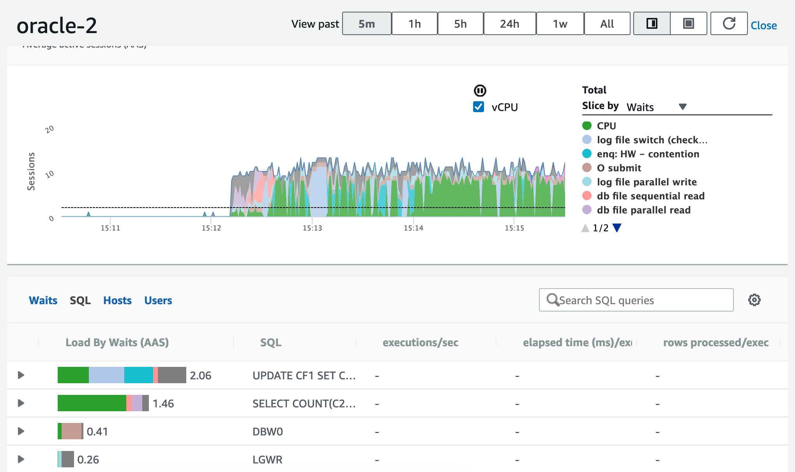

# RDS Oracle hands-on (L200)

- [1. Setup](#1-setup)
  - [Provisioning Oracle](#provisioning-oracle)
    - [Advanced discussions](#advanced-discussions)
  - [Provisioning Cloud9](#provisioning-cloud9)
  - [Connect from Cloud9](#connect-from-cloud9)
  - [Loading sample data](#loading-sample-data)
    - [Install SLOB](#install-slob)
    - [Configure tnsnames.ora](#configure-tnsnamesora)
    - [Populate the sample database](#populate-the-sample-database)
    - [Load the sample schemas](#load-the-sample-schemas)
    - [Verify the data load](#verify-the-data-load)
- [2. Monitoring](#2-monitoring)
  - [CloudWatch Metrics](#cloudwatch-metrics)
  - [Enhanced monitoring](#enhanced-monitoring)
  - [Performance insight](#performance-insight)
- [3. Upgrade](#3-upgrade)
    - [Advanced discussion](#advanced-discussion)
- [4. Availability](#4-availability)
  - [PITR](#pitr)
  - [Read Replica](#read-replica)
- [5. Working with snapshots](#5-working-with-snapshots)
  - [Copy across regions](#copy-across-regions)
- [6. Advanced topics: Architecture with Aurora](#6-advanced-topics-architecture-with-aurora)

# 1. Setup

## Provisioning Oracle

* Engine options
    * Oracle EE > 19.0.0.0.ru-2020-01
* Template
    * Dev/Test
* DB instance size
    * Burstable classes > db.t3.medium
* Additional configuration
    * Enable all log exports (alert, audit, listener, trace log)


### Advanced discussions

* Override number of CPU cores (BYOL only) - [doc](https://docs.aws.amazon.com/AmazonRDS/latest/UserGuide/Concepts.DBInstanceClass.html#USER_ConfigureProcessor)
  
* Storage IOPS & autoscaling - [doc](https://docs.aws.amazon.com/AmazonRDS/latest/UserGuide/CHAP_Storage.html#Concepts.Storage.GeneralSSD)
* Multi-AZ - [blog](https://aws.amazon.com/blogs/database/amazon-rds-under-the-hood-multi-az/)
* Understanding Oracle release schedule - [Oracle support](https://support.oracle.com/knowledge/Oracle%20Database%20Products/742060_1.html)

## Provisioning Cloud9

Cloud9 is a cloud IDE for writing, running, and debugging code. We will need a **t3.small** instance for a small scale load test.


In just a minute, we now have a cloud based development environment with AWS CLI. Next, install Oracle instant client (basic package and sqlplus, RPM) from the [Oracle website](https://www.oracle.com/database/technologies/instant-client/linux-x86-64-downloads.html).

```
wget https://download.oracle.com/otn_software/linux/instantclient/19600/oracle-instantclient19.6-basic-19.6.0.0.0-1.x86_64.rpm

wget https://download.oracle.com/otn_software/linux/instantclient/19600/oracle-instantclient19.6-sqlplus-19.6.0.0.0-1.x86_64.rpm
```
```
sudo yum install oracle-instantclient19.6-sqlplus-19.6.0.0.0-1.x86_64.rpm oracle-instantclient19.6-basic-19.6.0.0.0-1.x86_64.rpm
```

## Connect from Cloud9

Lodate the RDS endpoint from the console


Locate the inbound security group


Edit the inbound rules


Add a rule to allow Oracle (TCP 1521) access from the cloud9 security group


Test the connectivity from the Cloud9 client
```
$ sqlplus admin@oracle-2.cduf5ueot2nx.ap-east-1.rds.amazonaws.com/ORCL

Connected to:
Oracle Database 19c Enterprise Edition Release 19.0.0.0.0 - Production
Version 19.6.0.0.0

SQL> select * from v$version;
```


## Loading sample data

> Reference: https://github.com/therealkevinc/SLOB_distribution

### Install SLOB

```
$ git clone https://github.com/therealkevinc/SLOB_distribution.git

Cloning into 'SLOB_distribution'...
remote: Enumerating objects: 46, done.
remote: Counting objects: 100% (46/46), done.
remote: Compressing objects: 100% (45/45), done.
remote: Total 141 (delta 16), reused 0 (delta 0), pack-reused 95
Receiving objects: 100% (141/141), 21.76 MiB | 5.39 MiB/s, done.
Resolving deltas: 100% (56/56), done.
```

```
$ cd SLOB_distribution
$ tar xzvf 2020.01.30.slob_2.5.2.4.tar.gz
```

### Configure tnsnames.ora

```
$ cd /usr/lib/oracle/19.6/client64/lib/network/admin
$ sudo nano tnsnames.ora
```

Replace the HOST with RDS endpoint and paste the following into the editor
```
ORCL=
  (DESCRIPTION =
    (ADDRESS_LIST =
      (ADDRESS = (PROTOCOL = TCP)(HOST = oracle-2.cduf5ueot2nx.ap-east-1.rds.amazonaws.com)(PORT = 1521))
    )
    (CONNECT_DATA =
      (SERVER=dedicated)
      (SERVICE_NAME = ORCL)
    )
  ) 
```


### Populate the sample database

Create the tablespace
```
$ cd ~/environment/SLOB_distribution/
$ sqlplus admin@ORCL

SQL> @SLOB/misc/ts  


SQL> set timing on
SQL> drop tablespace IOPS including contents and datafiles;
drop tablespace IOPS including contents and datafiles
*
ERROR at line 1:
ORA-00959: tablespace 'IOPS' does not exist


Elapsed: 00:00:00.02
SQL> 
SQL> create BIGFILE tablespace IOPS datafile size 1G
  2  NOLOGGING ONLINE PERMANENT EXTENT MANAGEMENT LOCAL AUTOALLOCATE SEGMENT SPACE MANAGEMENT AUTO ;

Tablespace created.

Elapsed: 00:00:07.28
SQL> 
SQL> alter tablespace IOPS autoextend on next 200m maxsize unlimited;

Tablespace altered.

Elapsed: 00:00:00.02
SQL> exit;
Disconnected from Oracle Database 19c Enterprise Edition Release 19.0.0.0.0 - Production
Version 19.6.0.0.0
```


### Load the sample schemas
Edit `SLOB/slob.conf`, uncomment and change the following line:
```
ADMIN_SQLNET_SERVICE=ORCL
SQLNET_SERVICE_BASE=ORCL

DBA_PRIV_USER="admin"
SYSDBA_PASSWD="xxxxxxxxxxxx"
```

Edit `SLOB/setup.sh`, modify the return code (from 1 to 0) of two functions (as Oracle instant client does not come with tnsping).
```
for exe in sqlplus tnsping
do 
        if ( ! type $exe >> $LOG 2>&1 )
        then
                f_msg FATAL ""
                f_msg FATAL "${FUNCNAME}: Please validate your environment. SQL*Plus is not executable in current \$PATH"
                f_msg FATAL ""
                return 0
        fi
done
```

```
if ( ! tnsping $svc >> $LOG 2>&1 )
then
        f_msg FATAL ""
        f_msg FATAL "${FUNCNAME}: tnsping failed to validate SQL*Net service ( $svc )"
        f_msg FATAL "Examine $LOG"
        return 1f_msg FATAL "${FUNCNAME}: Please validate your environment. SQL*Plus is not executable in current \$PATH"
fi
                return 0
        fi
done
```

Run `setup.sh`
```
$ cd SLOB
$ ./setup.sh IOPS 8

NOTIFY  : 2020.06.17-07:03:22 : SLOB setup complete. Total setup time:  (53 seconds)
```

Compile the wait kit
```
$ cd wait_kit
$ make
```

### Verify the data load
```
$ cd ..
$ cat slob_data_load_summary.txt

OWNER      TABLE_NAME         NUM_ROWS           BLOCKS                         
---------- ---------- ---------------- ----------------                         
USER1      CF1                  10,148           11,123                         
USER1      CF2                     128              134                         
USER2      CF1                  10,240           10,381                         
USER2      CF2                     128              134                         
USER3      CF1                  10,240           10,381                         
USER3      CF2                     128              134                         
USER4      CF1                  10,240           10,381                         
USER4      CF2                     128              134                         
USER5      CF1                  10,240           10,381                         
USER5      CF2                     128              134                         
USER6      CF1                  10,240           10,381                         
USER6      CF2                     128              134                         
USER7      CF1                  10,240           10,381                         
USER7      CF2                     128              134                         
USER8      CF1                  10,240           10,381                         
USER8      CF2                     128              134                         

16 rows selected.
```

# 2. Monitoring

## CloudWatch Metrics
Browse to the **Monitoring** tab and check
* CPU/RAM
* Disk space
* Network traffic
* Database connections
* IOPS metrics

## Enhanced monitoring
> Look at metrics in real-time for the operating system

Select **Enhanced monitoring**


Check the list of available metrics


## Performance insight
> Illustrate your database's performance and help you analyze any issues that affect it.

Generate some loading to the database
```
$ ./runit.sh 8

NOTIFY  : 2020.06.17-07:11:57 : Clearing temporary SLOB output files from previous SLOB testing.
NOTIFY  : 2020.06.17-07:11:57 : Testing admin connectivity to the instance to validate slob.conf settings.
NOTIFY  : 2020.06.17-07:11:57 : Testing connectivity. Command: "sqlplus -L corvus/Oracle123456@ORCL".
NOTIFY  : 2020.06.17-07:11:58 : Next, testing 8 user (non-admin) connections...
NOTIFY  : 2020.06.17-07:11:58 : Testing connectivity. Command: "sqlplus -L user1/user1@ORCL".
NOTIFY  : 2020.06.17-07:11:59 : Testing connectivity. Command: "sqlplus -L user8/user8@ORCL".
NOTIFY  : 2020.06.17-07:12:00 : Performing redo log switch.
NOTIFY  : 2020.06.17-07:12:01 : Redo log switch complete. Setting up trigger mechanism.
NOTIFY  : 2020.06.17-07:12:11 : Running iostat, vmstat and mpstat on current host--in background.
NOTIFY  : 2020.06.17-07:12:11 : Connecting 1 (THREADS_PER_SCHEMA) session(s) to 8 schema(s) ...
NOTIFY  : 2020.06.17-07:12:11 :  
NOTIFY  : 2020.06.17-07:12:11 : Test has been triggered. Processes are executing. Warm-up phase.
```
Check the **Performance insight**


# 3. Upgrade

Modify the database instance, and select a newer (minor) version, e.g., 19.0.0.0.ru-2020-04


### Advanced discussion

While upgrading, it's a good time to review different fault tolerance options:

* Single-AZ: PITR (5-min RPO) - [doc](https://docs.aws.amazon.com/AmazonRDS/latest/UserGuide/USER_PIT.html)
* Multi-AZ: automatic failover (typically within 1-2 minutes)
* Read-replica: scaling read-only workload - [doc](https://docs.aws.amazon.com/AmazonRDS/latest/UserGuide/USER_ReadRepl.html)

# 4. Availability

## PITR

RDS uploads transaction logs for DB instances to Amazon S3 every 5 minutes. We can create a new database instance with data up to the latest restorable time.

From the console, select **Restore to point in time**


## Read Replica

Updates made to the source DB instance are asynchronously copied to the read replica. We can make use of this to scale out elastically for read-heavy database workloads.

From the console, select **Create read replica**


Notes:

* Can create read replica in another region (not available in HKG yet)
* Can create read replica on read replica, but not circular action
* Can promote read replica to a standalone DB instance


# 5. Working with snapshots

## Copy across regions

> Currently not available in HKG


# 6. Advanced topics: Architecture with Aurora

* Cloud native storage - [blog](https://aws.amazon.com/blogs/database/introducing-the-aurora-storage-engine/)
* High availability with (Aurora) read replica - [doc](https://docs.aws.amazon.com/AmazonRDS/latest/AuroraUserGuide/Concepts.AuroraHighAvailability.html)
* Global database - [10min tutorial](https://aws.amazon.com/getting-started/hands-on/aurora-global-database/)
* Aurora read replica auto-scaling - [10min tutorial](https://aws.amazon.com/getting-started/hands-on/aurora-autoscaling-with-readreplicas/)
