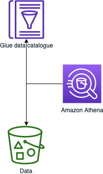
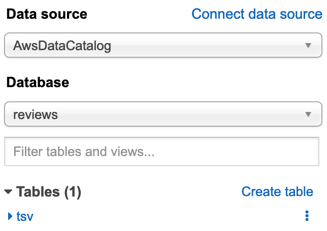

In this task you will utilize Amazon Athena to take a quick look at the raw data, using the data catalogue on AWS Glue while data residing on S3 buckets.



1. Open the [Amazon Athena Console](https://console.aws.amazon.com/athena/home)
2. Set up a query result location in Amazon S3
   1. Query result location: *s3://athena.out.yourname/*
   2. Encrypt query results: *yes, SSE-S3*
   3. Autocomplete: *yes*
3. Select `reviews` from the database list

4. In the **Query Editor** try the following statements and note the response times:

Total number of review counts
```sql
SELECT COUNT(*) total_count
FROM tsv;
```
1m16s, 32.22GB

Review counts and average star rating per product category
```sql
SELECT
  product_category,
  COUNT(*) review_count,
  AVG(CAST(star_rating AS real)) avg_star
FROM tsv
GROUP BY product_category;
```
1m40s, 32.22GB

> Note that both queries did a full table scan and retrieved all columns (32.22GB). We will next process the data and store with a better structure in a curated bucket.