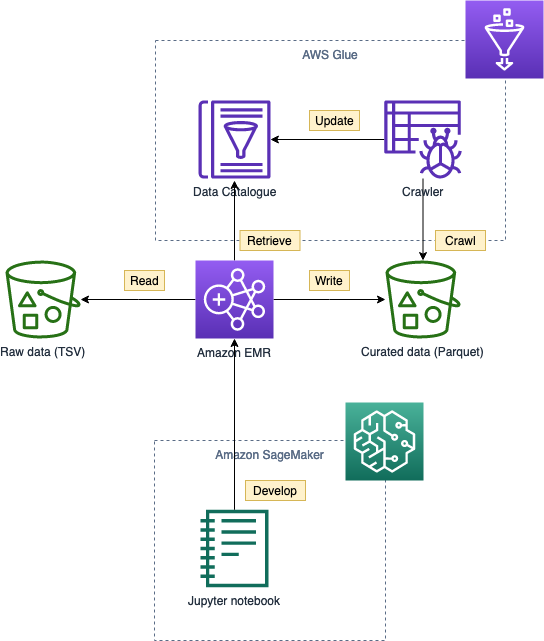
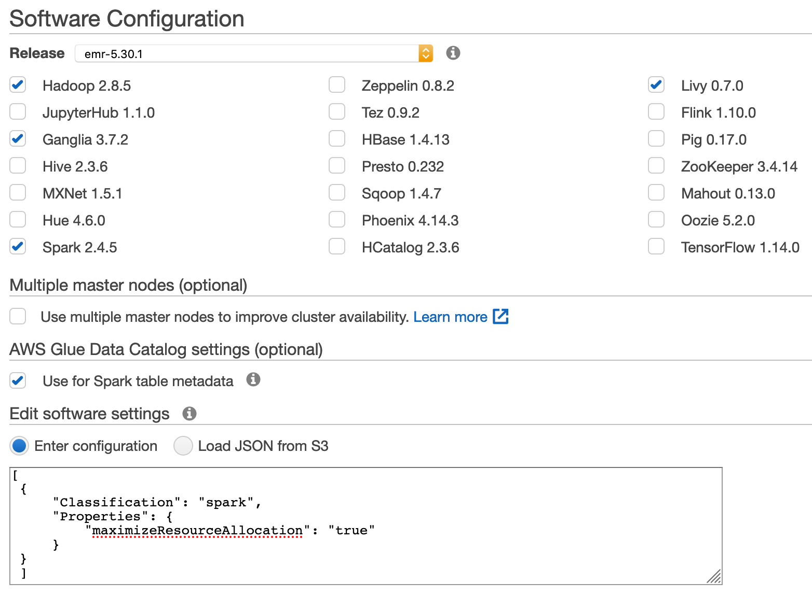
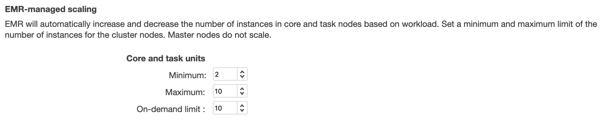
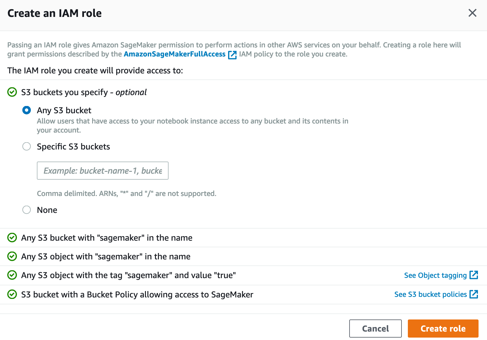
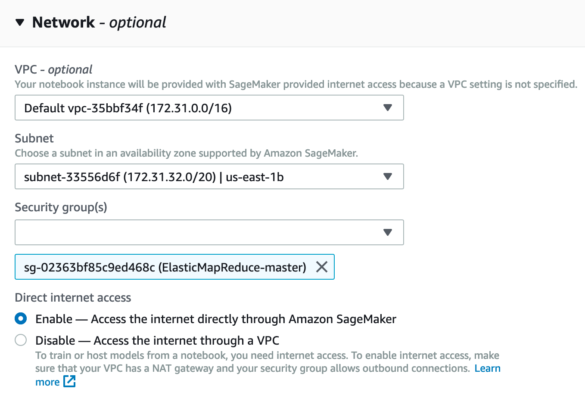

In this task you will
* Provision an Amazon EMR cluster for data processing with Spark
* Provision a notebook instance in Amazon SageMaker and connect to the EMR cluster
* Develop a simple PySpark script to convert the customer reviews to Parquet files partitioned by product category



- [Provision Amazon EMR](#provision-amazon-emr)
  - [Software configuration](#software-configuration)
  - [Hardware configuration](#hardware-configuration)
  - [General options](#general-options)
  - [Security options](#security-options)
- [Provision Amazon SageMaker](#provision-amazon-sagemaker)
  - [Lifecycle configurations](#lifecycle-configurations)
  - [Notebook instance](#notebook-instance)
- [Author a data processing job](#author-a-data-processing-job)

# Provision Amazon EMR

## Software configuration

1. Open the [Amazon EMR Console](https://console.aws.amazon.com/elasticmapreduce/home?)
2. Click **Create cluster**
3. Click **Go to advanced options**
4. Select the latest (stable) EMR release
   * Checkbox: *Hadoop, Ganglia, Spark, Livy*
5. Use Glue Data Catalog for Spark table metadata: *yes*
6. Edit the software settings with the following:
   ```json
   [
    {
        "Classification": "spark",
        "Properties": {
            "maximizeResourceAllocation": "true"
        }
    }
    ]
   ```
   

> For cost optimization, we can select **Cluster auto-terminates**, which is effective for scheduled batch processing (e.g., daily night job) with a transient cluster. For this workshop, we will not make use of this feature.

## Hardware configuration

1. Accept the defaults, and we will have a cluster made of m5.xlarge instances
2. Enable **cluster scaling** (EMR-managed, 2-10 nodes)
3. Click **Next**
   

> Notice the **spot instance** features for further cost optimization

## General options
1. Cluster name: *reviews*
2. Click **Next**

## Security options
1. Provide an EC2 key pair (optional) so we can connect to the master node via SSH
2. Click **Create cluster**
3. Wait a minute and copy the `master public DNS` (e.g., ec2-3-94-120-86.compute-1.amazonaws.com)

# Provision Amazon SageMaker

## Lifecycle configurations

1. Open the [Amazon SageMaker Console](https://console.aws.amazon.com/sagemaker/home)
1. Click **Lifecycle configurations** under **Notebook**
2. Click **Create configurations**
3. Name: *emr*
4. Modify the `EMR_MASTER_IP` and paste into the script
    ```bash
    # PARAMETERS
    EMR_MASTER_IP=your.emr.master.ip


    cd /home/ec2-user/.sparkmagic

    echo "Fetching Sparkmagic example config from GitHub..."
    wget https://raw.githubusercontent.com/jupyter-incubator/sparkmagic/master/sparkmagic/example_config.json

    echo "Replacing EMR master node IP in Sparkmagic config..."
    sed -i -- "s/localhost/$EMR_MASTER_IP/g" example_config.json
    mv example_config.json config.json

    echo "Sending a sample request to Livy.."
    curl "$EMR_MASTER_IP:8998/sessions"                                    
    ```

## Notebook instance

1. Click **Notebook instances** under **Notebook**
3. Click **Create notebook instance**
4. Notebook instance settings:
   1. Notebook instance name: reviews
   2. Notebook instance type: ml.t2.medium (default)
   3. Elastic Inference: None (default)
   4. Lifecycle configuration: *emr*
5. Permissions and encryption:
   1. Create a new IAM role
      1. Grant access to any S3 bucket
   2. Enable root access (default)
   3. No custom encryption (default)
6. Network:
   1. Select the default VPC
   2. Select the same subnet as the EMR cluster
   3. Select the `ElasticMapReduce-master` security group
   4. Enable direct Internet access (default)
7. Create notebook instance

# Author a data processing job

1. From the notebook instance, open **Jupyter**
2. Upload the notebook: [05a_Amazon Customer Reviews - processing.ipynb](05a_Amazon%20Customer%20Reviews%20-%20processing.ipynb)
3. Follow the instructions within