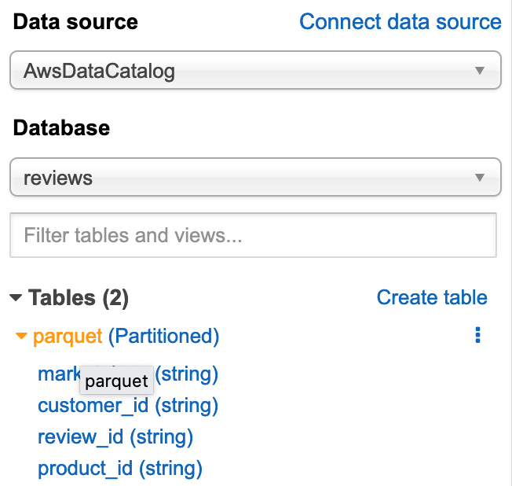

In this task you will utilize Amazon Athena to take a quick look at the curated data, and compare the query performance with the those against raw data.


1. Open the [Amazon Athena Console](https://console.aws.amazon.com/athena/home)
2. Select `reviews` from the database list
  
3. In the **Query Editor** try the following statements and note the response times:

Total number of review counts
```sql
SELECT COUNT(*) total_count
FROM parquet;
```
1.78s, 0KB

Review counts and average star rating per product category
```sql
SELECT
  product_category,
  COUNT(*) review_count,
  AVG(CAST(star_rating AS real)) avg_star
FROM parquet
GROUP BY product_category;
```
1.7s, 55.63MB

> Previous results against TSV files:
> * First query: 1m16s, 32.22GB
> * Second query: 1m40s, 32.22GB
