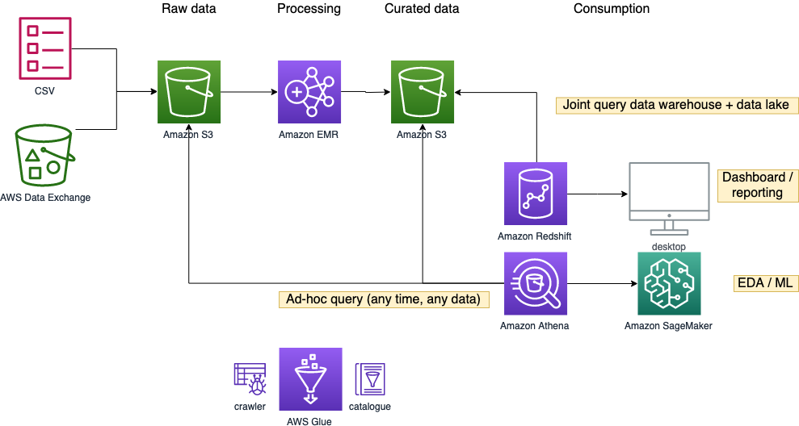
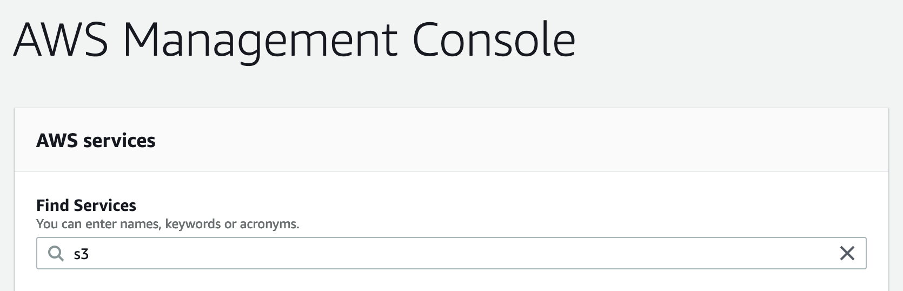
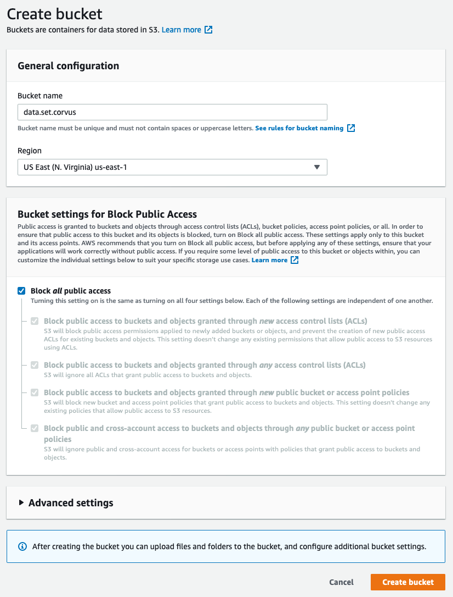

# Overview 

In this lab, you will:
* **Catalog** the Amazon Customer Reviews Dataset (32GB) in TSV format using AWS Glue
* Perform **ad-hoc query** using Amazon Athena
* **Data processing** with Spark in Amazon EMR
* Create a single view in a **data warehouse** (with product dimension) with Amazon Redshift integrating the reviews data
* **Build and deploy a machine learning model** to predict the product star rating using Amazon SageMaker Autopilot

Duration:
* 1.5 hour

# Preparation

> Please use Chrome or Firefox browser to ensure smooth lab experience

* Sign in to the AWS Management Console using the provided credentials
* Make sure you are using the `us-east-1` region for the whole workshop

## Create S3 buckets

1. Click **Create bucket**
   * Bucket name: *s3://athena.out.yourname*
   * Region: *us-east-1*
2. Create another bucket
   * Bucket name: *s3://data.set.yourname*
   * Region: *us-east-1*
  

## Create EC2 keypair

1. Go to the [EC2 console](https://console.aws.amazon.com/ec2/v2/home) 
2. Under **Network & Security**, click **Key Pairs**
3. Click **Create key pair**
   * Name: *yourname*
   * File format: *pem* 