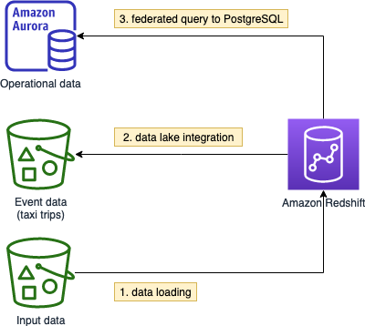

# Overview

In this lab, you will:
* Provision an Amazon Redshift cluster and explore the operations
* Load sample data from a Amazon S3 bucket using the `COPY` command
* Query event data directly in the Amazon S3 data lake using Amazon Redshift Spectrum
* Query operational data in PostgreSQL using federation

Duration:
* 1.5 hour

# Preparation

> Please use Chrome or Firefox browser to ensure smooth lab experience

* Sign in to the AWS Management Console using the provided credentials
* Make sure you are using the `us-west-2 (Oregon)` region for the whole workshop