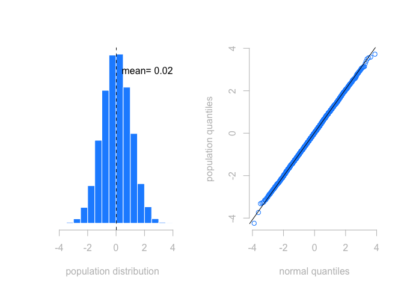
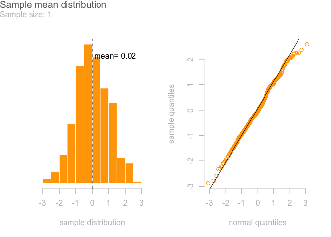
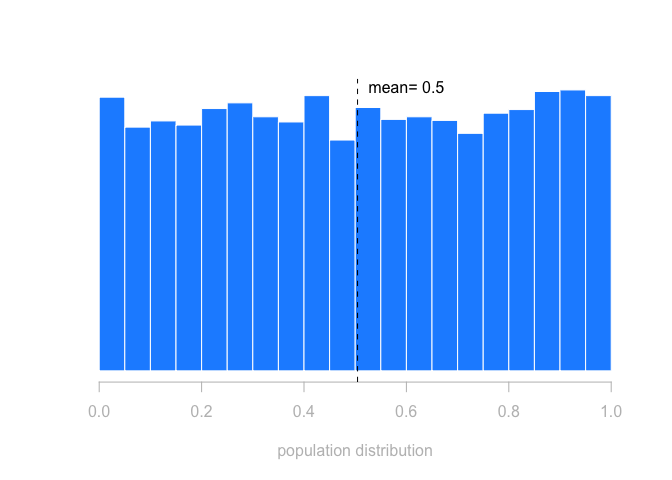
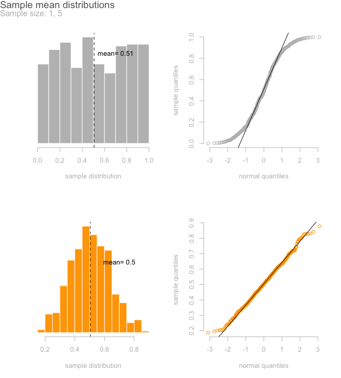
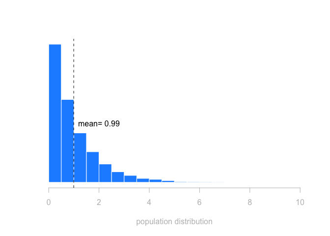
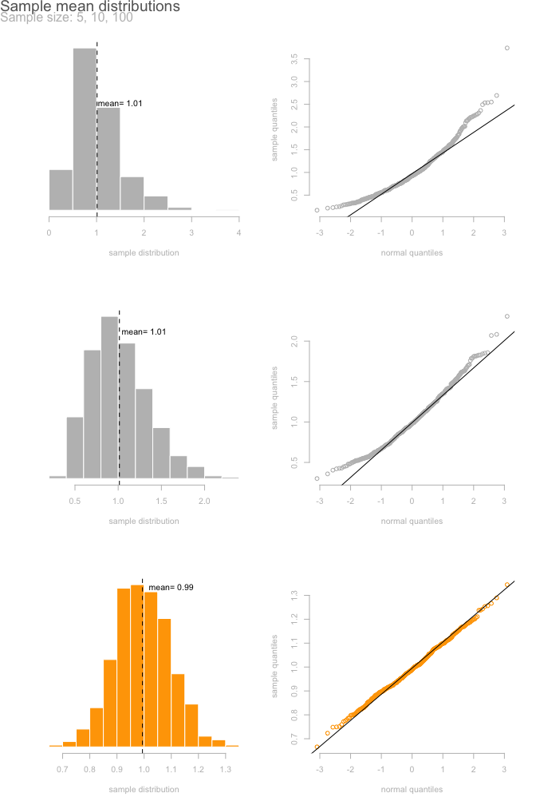
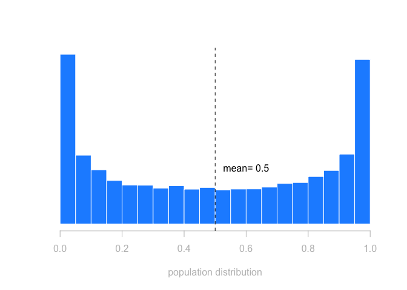
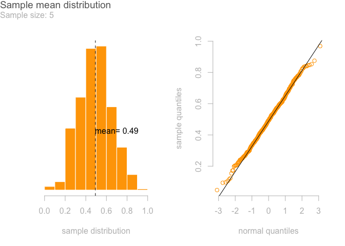

Central Limit Theorem
================
Corvus LEE
2019-12-28

# 1\. What is CLT?

If the sample size is sufficiently large enough, then the mean of the
samples will follow a normal distribution, no matter what the underlying
population distribution is. In this notebook I will illustrate how well
the theorem applies to different distributions with different sample
sizes.

# 2\. Population: Normal distribution

``` r
# Generate a standard normal population with size 10000
set.seed(8000)
y <- rnorm(10000)
```

<!-- -->

Sample mean will always follow normal distribution for all sample sizes

``` r
# Generate 500 samples with sample size of one
sample <- double()
set.seed(8001)
for (i in 1:500) {
  sample <- append(sample, sample(y,1))
}
```

<!-- -->

# 3\. Population: Uniform distribution

``` r
# Generate an uniform population with size 10000
set.seed(8000)
y <- runif(10000)
```

<!-- -->

CLT applies well to uniformly distributed population with small sample
size (e.g., 5)

``` r
# Generate 500 samples with various sample sizes
sample1 <- double()
sample5 <- double()

# sample size: 1
set.seed(8001)
for (i in 1:500) {
  sample1 <- append(sample1, mean(sample(y,1)))
}

# sample size: 5
set.seed(8001)
for (i in 1:500) {
  sample5 <- append(sample5, mean(sample(y,5)))
}
```

<!-- -->

# 4\. Population: Exponential distribution

``` r
# Generate an exponential population with size 10000
set.seed(8000)
y <- rexp(10000)
```

<!-- -->

With an exponential distribution, CLT starts to apply with a sample size
of ten. The distribution looks much nicer when we have a sample size of
a hundred.

``` r
# Generate 500 samples with various sample sizes
sample5 <- double()
sample10 <- double()
sample100 <- double()

# sample size: 5
set.seed(8001)
for (i in 1:500) {
  sample5 <- append(sample5, mean(sample(y,5)))
}

# sample size: 10
set.seed(8001)
for (i in 1:500) {
  sample10 <- append(sample10, mean(sample(y,10)))
}

# sample size: 100
set.seed(8001)
for (i in 1:500) {
  sample100 <- append(sample100, mean(sample(y,100)))
}
```

<!-- -->

# 5\. Population: Other distribution

``` r
# Generate a population with size 10000
set.seed(8000)
y <- rbeta(10000, .5, .5)
```

<!-- -->

Surprisingly CLT applies really well to this beta distribution

``` r
# Generate 500 samples with various sample sizes
sample5 <- double()

# sample size: 5
set.seed(8001)
for (i in 1:500) {
  sample5 <- append(sample5, mean(sample(y,5)))
}
```

<!-- -->
