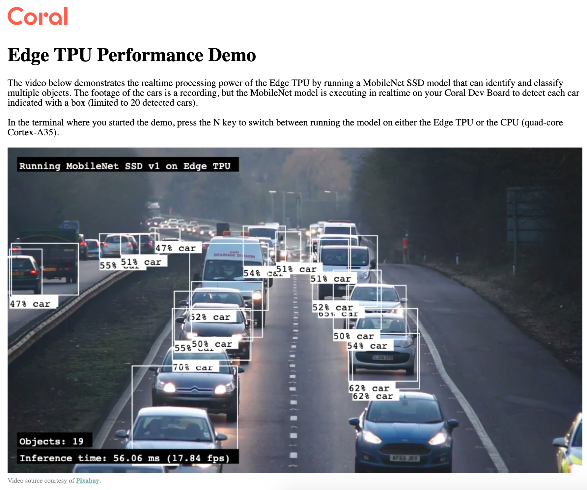

- [1. Connect the Coral camera](#1-connect-the-coral-camera)
  - [1.1. Downloading sample models](#11-downloading-sample-models)
  - [1.2. Running detections in headless mode](#12-running-detections-in-headless-mode)
    - [1.2.1. Object detection](#121-object-detection)
    - [1.2.2. Face detection](#122-face-detection)
    - [1.2.3. Viewing the live stream](#123-viewing-the-live-stream)

# 1. Connect the Coral camera
> Follow the [official guide](https://www.coral.ai/docs/dev-board-mini/camera/#connect-the-coral-camera) to connect the cable.

## 1.1. Downloading sample models

This GitHub [repo](https://github.com/google-coral/examples-camera) contains a few examples which use camera stream with pre-trained TensorFlow Lite models.

1. Cloning the repository
```
git clone https://github.com/google-coral/examples-camera.git --depth 1
```

2. Download the models
```
cd examples-camera

sh download_models.sh
```

## 1.2. Running detections in headless mode

### 1.2.1. Object detection

```
edgetpu_detect_server --model all_models/mobilenet_ssd_v2_coco_quant_postprocess_edgetpu.tflite --labels examples-camera/all_models/coco_labels.txt --top_k 5
```

### 1.2.2. Face detection

```
edgetpu_detect_server --model all_models/mobilenet_ssd_v2_face_quant_postprocess_edgetpu.tflite --top_k 5
```

### 1.2.3. Viewing the live stream

Open a browser and go to *http://\<your-coral-board\>:4664*, and we will see bounding boxes and labels around the detected objects. Depending on the selected model, the Coral Dev Board Mini can achieve inference speed at 10+ FPS or 20+ FPS.

> Example screenshot using `edgetpu_demo --stream`. Note that the inference using CPU is just 1.35fps vs TPU with 17.84fps

