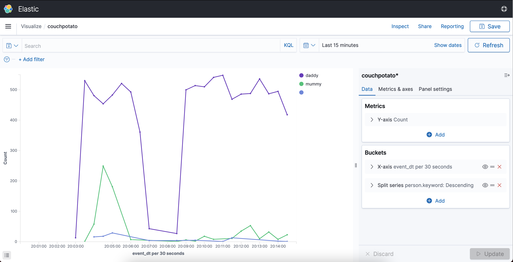

- [1. Preparation](#1-preparation)
  - [1.1. Conda environment](#11-conda-environment)
  - [1.2. Test the connection](#12-test-the-connection)
  - [1.3. Create an index for documents ingestion](#13-create-an-index-for-documents-ingestion)
  - [1.4. Write a sample document](#14-write-a-sample-document)
- [2. Modify the inference script](#2-modify-the-inference-script)
- [3. Run](#3-run)


# 1. Preparation
> Tested on Amazon Elasticsearch Services 7.10. We are skipping the provisioning process in this page, where the details can be found in the [official doc](https://docs.aws.amazon.com/elasticsearch-service/latest/developerguide/es-gsg.html).
>
> Config:
> * Dedicated master node: None
> * Data node: 1x r6g.large
> * EBS storage size: 30GB

## 1.1. Conda environment

In our project's conda environment, install the Elasticsearch API. According to the [repo](https://github.com/elastic/elasticsearch-dsl-py), Elasticsearch DSL is the high level library on top of the low level client. Let's give it a try:

```
conda install elasticsearch=7 elasticsearch-dsl=7
```

## 1.2. Test the connection

> Script at [scripts/elasticsearch.py](scripts/elasticsearch.py)

```py
from elasticsearch_dsl import connections


# init
es_endpoint = 'https://search-couchpotato-xxxx.eu-west-2.es.amazonaws.com/'

# create connection
conn = connections.create_connection(hosts=[es_endpoint])
```

## 1.3. Create an index for documents ingestion
```py
from elasticsearch_dsl import Index, Mapping, Date


index = 'couchpotato'

i = Index(index)
i.settings(number_of_shards=1, number_of_replicas=0)
i.save()
i.get()

m = Mapping()
m.field('event_dt', Date(format='epoch_second'))
m.save(index)
```

> Choosing the number of shards and replicas is out-of-scope in this page. For details, refer to the [best practices](https://docs.aws.amazon.com/elasticsearch-service/latest/developerguide/sizing-domains.html)

## 1.4. Write a sample document
```py
from elasticsearch_dsl import Document
import time


class Person(Document):
    pass


doc = Person()
doc.event_dt = time.time()
doc.confidence = .9
doc.person = 'daddy'
doc.save(index=index)

```

# 2. Modify the inference script

To start with, use the examples from https://github.com/google-coral/examples-camera

```
mkdir google-coral && cd google-coral

git clone https://github.com/google-coral/examples-camera.git --depth 1
```

We will use GStreamer to perform our own inferences. Copy all the Python scripts to the home directory
```
cp examples-camera/gstreamer/*.py ~
```

> Modify the GStreamer pipeline to `fakesink` since we are running in headless mode (i.e., without attaching to a LCD display), in [line 236 of gstreamer.py](https://github.com/google-coral/examples-camera/blob/19335531f599133e054ec2ddcc31733d24031ba5/gstreamer/gstreamer.py#L236)
> ```py
> t. ! queue ! glsvgoverlay name=gloverlay sync=false ! fakesink
> ```
>
> Sample [gstreamer.py](scripts/gstreamer.py)

`detect.py` is what we need to work on.

1. Comment out [line 110](https://github.com/google-coral/examples-camera/blob/19335531f599133e054ec2ddcc31733d24031ba5/gstreamer/detect.py#L110) since we are not at all interested in printing out the inference speed in the console.

```py
text_lines = [
    'Inference: {:.2f} ms'.format((end_time - start_time) * 1000),
    'FPS: {} fps'.format(round(next(fps_counter))),
]
# print(' '.join(text_lines))
```

2. In the `generate_svg` function, [line 65](https://github.com/google-coral/examples-camera/blob/19335531f599133e054ec2ddcc31733d24031ba5/gstreamer/detect.py#L65) is where we need to change to put the detection event to our Elasticsearch database.

```py
from elasticsearch_dsl import connections, Index, Mapping, Document, Date


# Elasticsearch preparation
es_endpoint = 'https://search-couchpotato-xxxx.eu-west-2.es.amazonaws.com/'
conn = connections.create_connection(hosts=[es_endpoint])
index = 'couchpotato'


class Person(Document):
    pass


# ...
# Line 65
label = '{}% {}'.format(percent, labels.get(obj.id, obj.id))
now = time.time()
# Write to ES
doc = Person()
doc.event_dt = now
doc.confident, doc.person = label.split()
doc.save(index=index)
```

> Sample [detect.py](scripts/detect.py)

# 3. Run
```
python3 detect.py \
  --model ssd_mobilenet_v2_couchpotato_quant_edgetpu.tflite \
  --labels labels.couchpotato.txt \
  --threshold=0.5
```

We should be able to see records ingested into Elasticsearch. Using Kibana to visualize the results is out-of-scope of this page, but the high level steps are:
1. Stack Management > Index Patterns
2. Discover
3. Visualize



Let's see who is the `couchpotato` of the day!