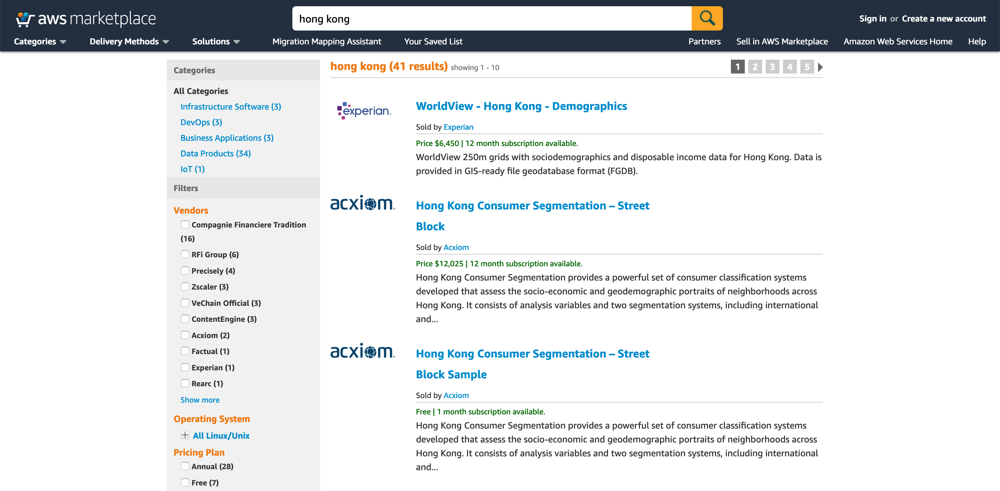
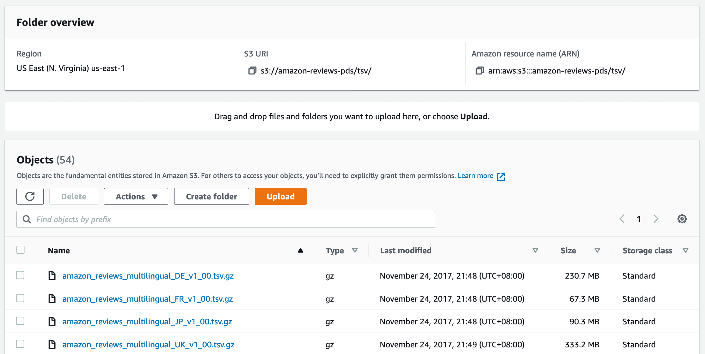
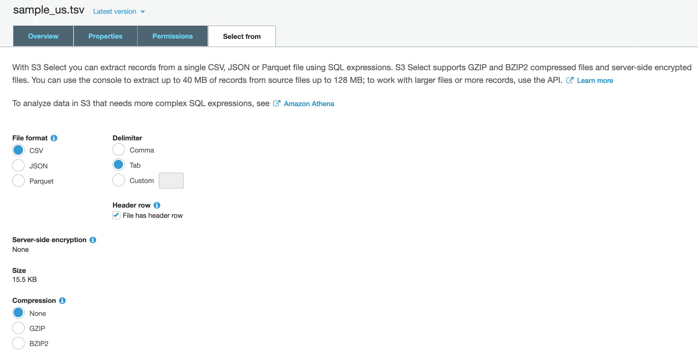

You start building the data lake with Amazon S3 as the primary data store. Given the scalability and durability of S3, it is best suited as the single source of truth for your data.

You can use various techniques to ingest and store data in your data lake, by batch or near realtime. In this lab, you will explore AWS Data Exchange and use a public dataset.

# Explore AWS Data Exchange

[Link](https://aws.amazon.com/marketplace/search/results?filters=FulfillmentOptionType&FulfillmentOptionType=AWSDataExchange)



# Amazon Customer Reviews Dataset

[Link](https://console.aws.amazon.com/s3/buckets/amazon-reviews-pds/tsv/?region=us-east-1)



In this public S3 bucket, we can find 130M+ customer reviews in TSV format. Some other common supported formats are JSON, XML, CSV, Parquet, etc. For the full list, please refer to the [doc](https://docs.aws.amazon.com/glue/latest/dg/add-classifier.html#classifier-built-in).

> Note: TSV (and CSV) is not optimized for analytics purpose. We'll process and convert the files in later section.

## Preview sample data

* Click the file **sample_us.tsv**
* Click the tab **Select from**
* Select the following options and click **Show file preview**
  * File format: *CSV*
  * Delimiter: *Tab*
  * Header row: *yes*


```
marketplace,customer_id,review_id,product_id,product_parent,product_title,product_category,star_rating,helpful_votes,total_votes,vine,verified_purchase,review_headline,review_body,review_date

US,18778586,RDIJS7QYB6XNR,B00EDBY7X8,122952789,Monopoly Junior Board Game,Toys,5,0,0,N,Y,Five Stars,Excellent!!!,2015-08-31
```