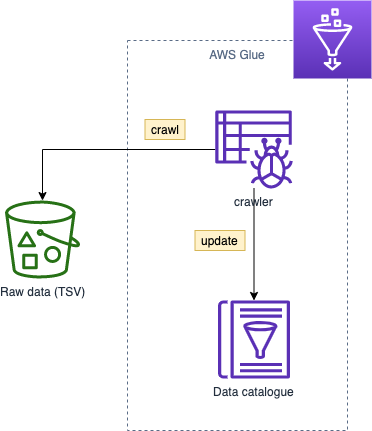
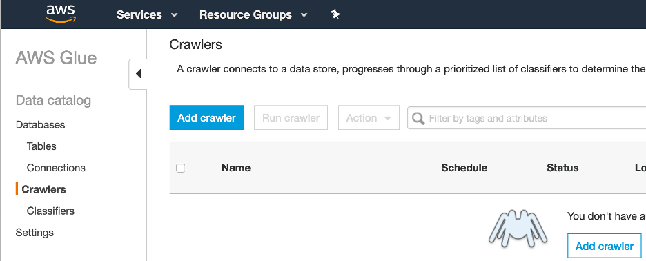
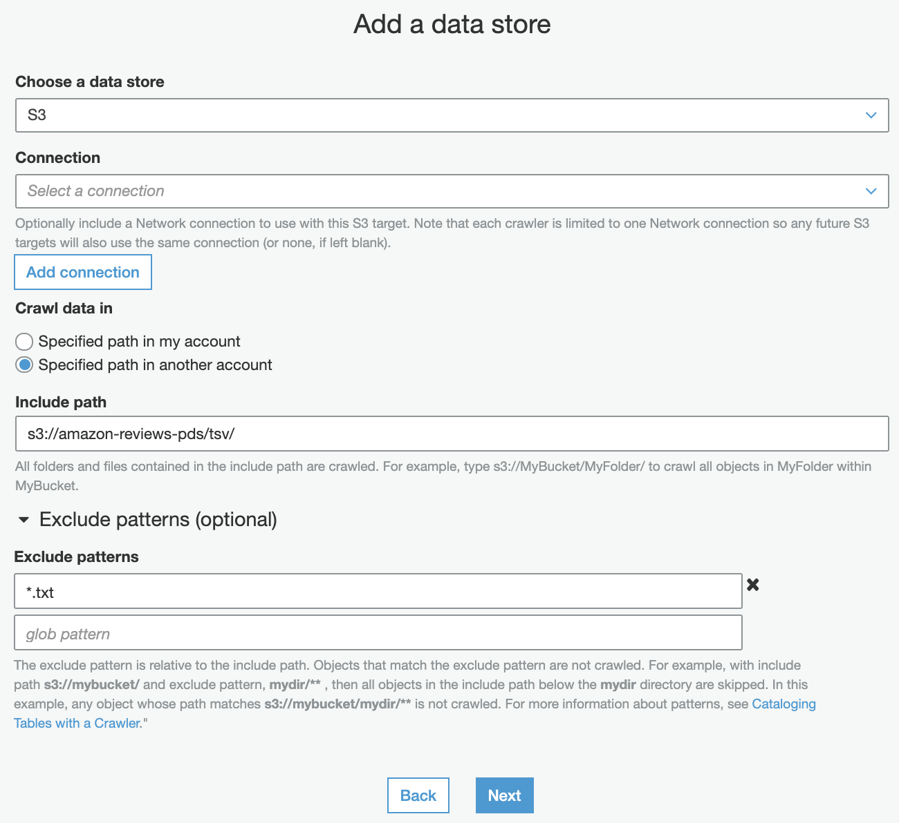
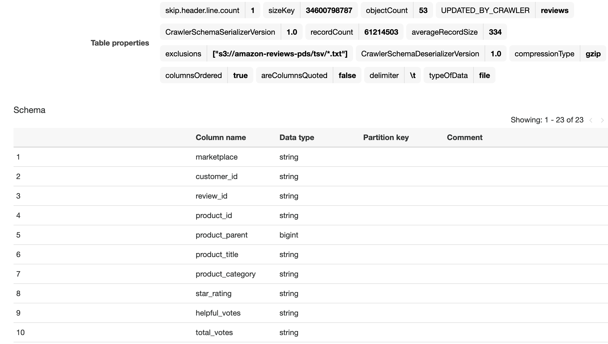

Data in S3 need to be catalogued before we can consume them with other AWS services such as Amazon EMR, Amazon Athena and Amazon Redshift. In this task, you will make the data available, crawl and catalogue the schema in the AWS Glue Data Catalog.

1. Open the [AWS Glue console](https://console.aws.amazon.com/glue/home)
2. Add a **crawler** under Data catalog
   1. Crawler name: *reviews*
   2. Crawler source type: *data stores* (default)
   3. Data store: *s3* (default)
      1. Include path: *s3://amazon-reviews-pds/tsv/*
      2. Exclude pattern: **.txt*
   4. Add another data store: *no* (default)
   5. Create an IAM role: *reviews-crawler*
   6. Frequency: *run on demand* (default)
   7. Add database: *reviews*
   8. Click **Finish**
   9.  Select your crawler *reviews* and click **Run crawler**
   10. The crawler runs for a minute and adds 1 table
3.  Click on **Tables** under data catalog and note the name of the table (*tsv*)
    1.  The crawler used built-in classifiers and identified the table, inferred the schema (columns/data types), and collected a set of properties.