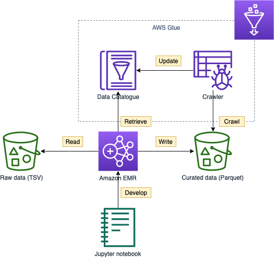

In this task you will
* Provision an Amazon EMR cluster for data processing with Spark
noo* Create an EMR notebook and connect to the cluster 
* Develop a simple PySpark script to convert the customer reviews to Parquet files partitioned by product category



- [Provision Amazon EMR](#provision-amazon-emr)
  - [Software configuration](#software-configuration)
  - [Hardware configuration](#hardware-configuration)
  - [General options](#general-options)
  - [Security options](#security-options)
- [Create EMR notebook](#create-emr-notebook)
- [Author a data processing job](#author-a-data-processing-job)

# Provision Amazon EMR

## Software configuration

1. Open the [Amazon EMR Console](https://console.aws.amazon.com/elasticmapreduce/home?)
2. Click **Create cluster**
3. Click **Go to advanced options**
4. Select the default EMR release
   * Checkbox: *Hadoop, Ganglia, Spark, Livy*
5. Use Glue Data Catalog for Spark table metadata: *yes*
6. Edit the software settings with the following:
   ```json
   [
    {
        "Classification": "spark",
        "Properties": {
            "maximizeResourceAllocation": "true"
        }
    }
    ]
   ```
   

> For cost optimization, we can select **Cluster auto-terminates**, which is effective for scheduled batch processing (e.g., daily night job) with a transient cluster. For this workshop, we will not make use of this feature.

## Hardware configuration

1. Cluster composition: *Instance fleets*
2. Networking
   1. Select the default VPC
   2. Select all available subnets (shift+mouse click)
3. Allocation strategy: *checked* (recommended)

4. Cluster Nodes and Instances
   1. master node - m5.xlarge (default)
   2. core node - r5.xlarge, r5.2xlarge, r5.4xlarge; 40 on-demand units
   3. task node - nil

5. Click **Next**


> Notice the **spot instance** and **cluster scaling** features for further cost optimization

## General options
1. Cluster name: *reviews*
2. Click **Next**

## Security options
1. Provide an EC2 key pair (generated in [README.md](README.md)) so we can connect to the master node via SSH
2. Click **Create cluster**
3. It takes around 5 minutes to provision the cluster

# Create EMR notebook

1. On the navigation menu, click **Notebooks**
2. Notebook name: *reviews*
3. Cluster: Choose the cluster provisioned in the previous section
4. Security groups: *default*
5. AWS service role: *Create default role*
6. Notebook location: *default*
7. Click **Create notebook**

# Author a data processing job

1. Click **Open in Jupyter** or **JupyterLab**
2. Open the page [05a_processing_emr_notebook.ipynb](05a_processing_emr_notebook.ipynb), download the ipynb file
3. Upload and open the notebook file
4. Follow the instructions within