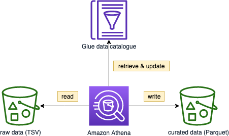

As the data to process is not big (32GB gzipped TSV), we can utilize Amazon Athena to perform simple transformation using CTAS and INSERT INTO - [doc](https://docs.aws.amazon.com/athena/latest/ug/ctas-insert-into-etl.html)

> Amazon Athena is priced on **compressed** data scanned - [link](https://aws.amazon.com/athena/pricing/?nc=sn&loc=3)



1. Open the [Amazon Athena Console](https://console.aws.amazon.com/athena/home)
2. Select `reviews` from the database list
3. Paste the following SQL into the **query editor**, and modify the `external_location`

```sql
CREATE TABLE reviews.parquet_athena 
WITH ( 
    format = 'Parquet',
    parquet_compression = 'SNAPPY',
    partitioned_by=array['product_category'],
    external_location = 's3://data.set.yourname/reviews-athena/us/'
)
AS
SELECT
  marketplace, 
  customer_id, 
  review_id, 
  product_id, 
  product_parent, 
  product_title, 
  CAST(star_rating as INTEGER) star_rating, 
  CAST(helpful_votes as INTEGER) helpful_votes, 
  CAST(total_votes as INTEGER) total_votes, 
  vine, 
  verified_purchase, 
  review_headline, 
  review_body, 
  CAST(review_date as DATE) review_date,
  product_category
FROM reviews.tsv
WHERE marketplace='US';
```

>  Run time: 4 minutes 17 seconds, Data scanned: 32.25 GB

4. You can skip session 6 as Amazon Athena will automatically create the table metadata in the Glue data catalogue