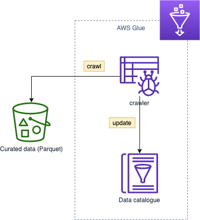
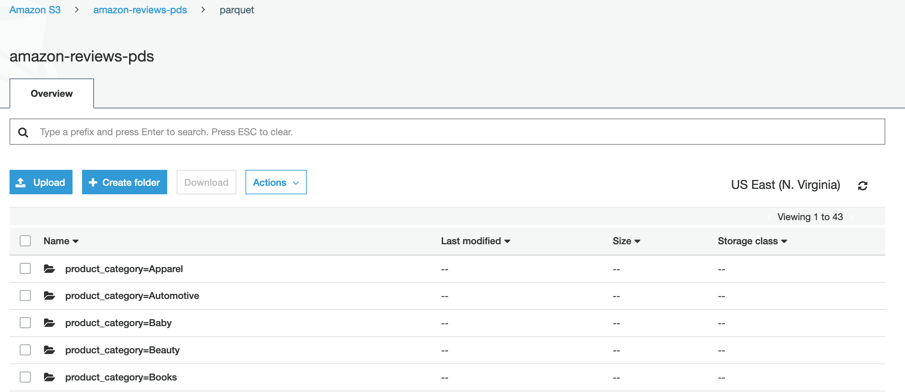
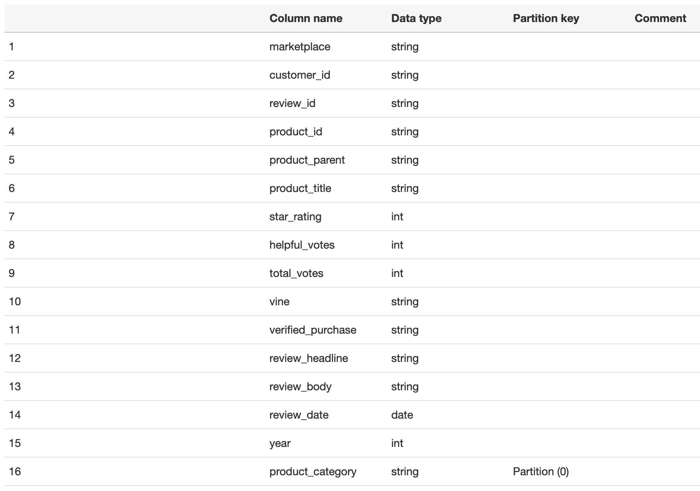

> If you have followed along with the Spark processing job, use `s3://data.set.yourname/reviews/us/`. Otherwise use this public S3 dataset `s3://amazon-reviews-pds/parquet/`

1. Open the [AWS Glue console](https://console.aws.amazon.com/glue/home)
2. Add a **crawler** under Data catalog
   1. Crawler name: *reviews-curated*
   2. Crawler source type: *data stores* (default)
   3. Data store: *s3* (default)
      1. Include path: *s3://amazon-reviews-pds/parquet/*
   4. Add another data store: *no* (default)
   5. Create an IAM role: *reviews-curated-crawler*
   6. Frequency: *run on demand* (default)
   7. Add database: *reviews*
   8. Click **Finish**
   9.  Select your crawler *reviews* and click **Run crawler**
   10. The crawler runs for a minute and adds 1 table
3.  Click on **Tables** under data catalog and note the name of the table (*parquet*)
    1.  The crawler used built-in classifiers and identified the table, inferred the schema (columns/data types), and collected a set of properties.
    2.  Notice how the parquet files are partitioned by product category in the S3 bucket. 
    3.  Notice how the Glue crawler infer the partition as an additional column. Queries filtered by this column require significantly less data scanned. 