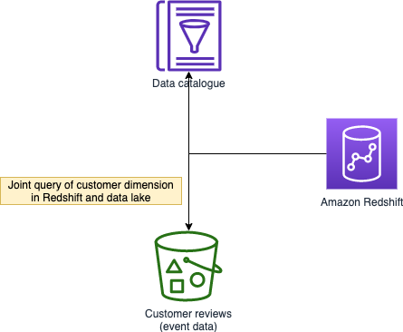
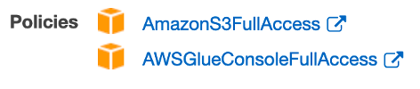
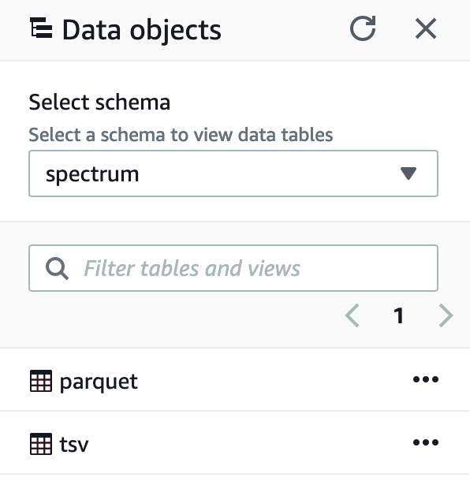
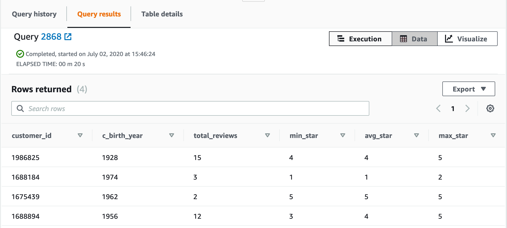
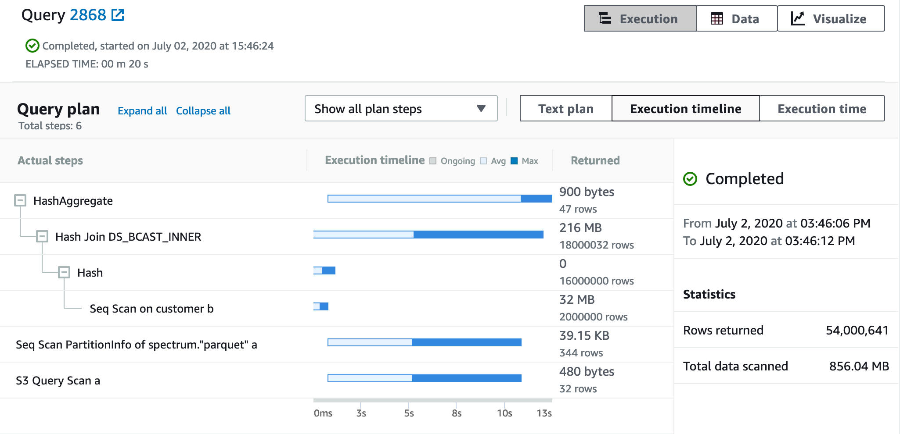

In this task you will provision an Amazon Redshift cluster, populate with a sample dimension table, and utilize Redshift Spectrum to join with event data in the S3 data lake.



# Provisioning

1. Create a **service role** in the [IAM Console](https://console.aws.amazon.com/iam/home)
   1.  Click **Roles**
   2.  Click **Create roles**
   3.  Choose the AWS service that will use this role: *Redshift*
       1.  Select your use case: *Redshift – Customizable*
       2.  Click **Next: Permissions**
   4.  Select (checker) the following policies:
       1.  *AmazonS3FullAccess*
       2.  *AWSGlueConsoleFullAccess*
   5.  Click **Next: Tags** and leave the tags blank
   6.  Click **Next: Review** and input the following:
       1.  Role name: *spectrum*
       2.  Role description: *Allows Redshift Spectrum to use Glue catalog and S3*
       3.  Click **Create role**
2.  Provision a data warehouse cluster in the [Redshift Console](https://console.aws.amazon.com/redshiftv2/)
    1.  Click **Create cluster**
        1.  Cluster identifier: *redshift-cluster-1* (default)
        2.  Node type: *dc2.large*
        3.  Nodes: *4*
        4.  Database name: *dev* (default)
        5.  Database port: *5439* (default)
        6.  Master user name: *awsuser* (default)
        7.  Master user password: *yourpassword*
        8.  Expand **Cluster permissions**
            1.  Choose an IAM role: *spectrum*
            2.  Click **Add IAM role**
    2.  Click **Create cluster**
3.  Click **Clusters** and wait until Status becomes *Available*
4.  Click **redshift-cluster-1** and browser through the actions and tabs
    * Actions: resize, pause/resume
    * Tabs: cluster performance, backup, properties

# Define the external schema in Redshift

First we create an external schema for the database in data lake, and the tables within.

1. Click **Query editor** and connect to your Redshift cluster
2. Run the follow codes
    ```sql
    CREATE EXTERNAL SCHEMA "spectrum"
    FROM DATA CATALOG
    DATABASE 'reviews'
    iam_role 'arn:aws:iam::<account_ID>:role/spectrum'
    CREATE EXTERNAL DATABASE IF NOT EXISTS;
    ```
3. Verify that we can see the `spectrum` schema and `parquet` table 

# Populate a sample dimension table (2M rows) in Redshift

```sql
CREATE TABLE customer
(
  c_customer_sk int4 not null ,                 
  c_customer_id char(16) not null ,             
  c_current_cdemo_sk int4 ,   
  c_current_hdemo_sk int4 ,   
  c_current_addr_sk int4 ,    
  c_first_shipto_date_sk int4 ,                 
  c_first_sales_date_sk int4 ,
  c_salutation char(10) ,     
  c_first_name char(20) ,     
  c_last_name char(30) ,      
  c_preferred_cust_flag char(1) ,               
  c_birth_day int4 ,          
  c_birth_month int4 ,        
  c_birth_year int4 ,         
  c_birth_country varchar(20) ,                 
  c_login char(13) ,          
  c_email_address char(50) ,  
  c_last_review_date_sk int4 ,
  primary key (c_customer_sk)
) distkey(c_customer_sk);
```

```sql
COPY customer FROM 's3://redshift-downloads/TPC-DS/100GB/customer/'
iam_role 'arn:aws:iam::<account_ID>:role/spectrum'
gzip delimiter '|' EMPTYASNULL region 'us-east-1' ;
```

```sql
ANALYZE customer;
```

# Join the event data with customer dimension

Notice how we can do a join between tables in data lake and within Redshift in a single query

```sql
SELECT
  customer_id,
  c_birth_year,
  COUNT(*) total_reviews,
  MIN(star_rating) min_star,
  AVG(star_rating) avg_star,
  MAX(star_rating) max_star
FROM spectrum.parquet a
  INNER JOIN customer b
  ON customer_id = c_customer_sk
WHERE customer_id IN (1688184, 1675439, 1986825, 1688894)
GROUP BY
  customer_id,
  c_birth_year
```



Click **Execution** and notice how most of the works have been pushed down to the S3 layer



# Use cases
## Explore new insights by joining business data with event data

With Redshfit Spectrum, you can now experiment and explore new insights by joining business data (e.g., revenue) with event data (e.g., clickstream), identifying patterns like customer behaviors prior to making purchase.

## Unload historical data to data lake

With Redshift Spectrum, you can also unload historical data (e.g., after one year) to data lake to make the data warehouse leaner. Additionally, you may create a late binding view across both historical data and current data.