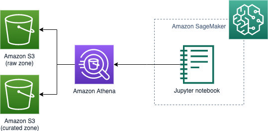
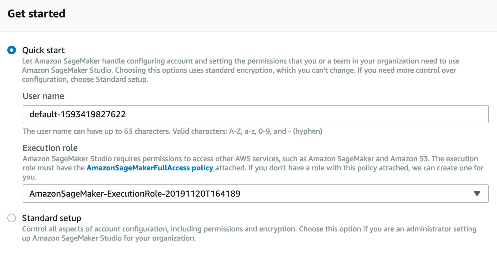

In this task you will get started with Amazon SageMaker, explore a Jupyter notebook with codes performing ad-hoc query to the data lake through PyAthena.

> **Amazon SageMaker Studio** is a ML IDE for building, training, and debugging models, tracking experiments, deploying models, and monitoring their performance.
> 
> **Amazon SageMaker Python SDK** is an open source library for training and deploying machine-learned models on Amazon SageMaker

# Provisioning

1. Go to the [Amazon SageMaker console](https://console.aws.amazon.com/sagemaker)
2. Click **Amazon SageMaker Studio**
3. Select the IAM role created in session [05-processing](05_processing.md)
   
4. Open Studio when the provisioning process has completed

## Additional IAM permissions
1. Go to the [IAM console](https://console.aws.amazon.com/iam)
2. Click **Roles**
3. Search for *AmazonSageMaker-ExecutionRole-xxxx*
4. Click **Attach policies**
5. Select *AmazonAthenaFullAccess*
6. Click **Attach policy**
   

# Data exploration

1. Upload the notebook: [09a_Amazon Customer Reviews - EDA.ipynb](09a_Amazon%20Customer%20Reviews%20-%20EDA.ipynb)
2. Follow the instructions in the notebook

