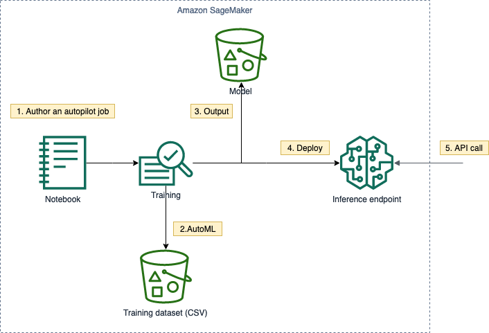
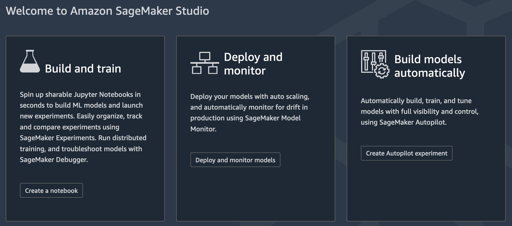
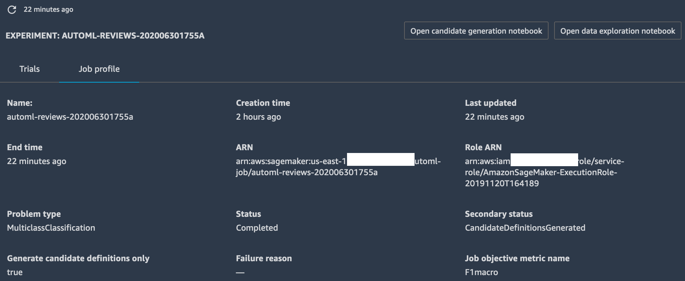
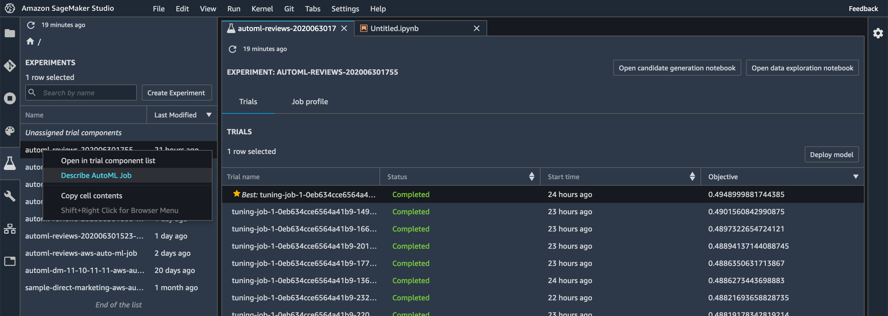
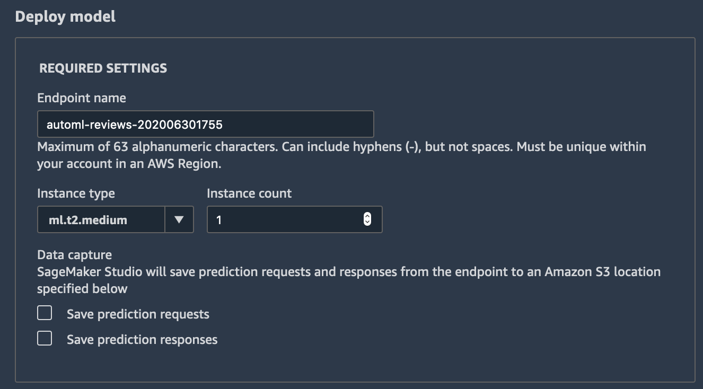

In this task you will explore Amazon SageMaker Autopilot, which will automatically preprocess data, select algorithm, optimize hyperparameter, (if applicable, distributed) training.



1. Create an Autopilot experiment
   1. Review the data exploration notebook
   2. Review the candidate generation notebook
2. Automated data transformation, training and hyperparameter tuning
3. Model output
4. Pipeline (model + data transformation) deployment 
5. Realtime inference

# Autopilot experiment
1. Click the **Amazon SageMaker Studio** icon on the top left corner 
2. Click **Create Autopilot experiment**
   1. Experiment name: *automl-reviews-yyyymmddhhmm*
   2. Enter S3 bucket location: *copy output in [09a_Amazon Customer Reviews - EDA]()*
   3. Target attribute name: *star_rating*
   4. Output data location: *sagemaker-us-east-1-youraccountid/automl*
   5. Machine learning problem type: *Multiclass classification*
   6. Objective metric: *F1 macro*
   7. Run a complete experiment: *Yes*
3. Click **Create Experiment**

> The whole process will take around 8 hours (6 hours of HPO, tunable).

## Data exploration

> It takes around 2 hours for SageMaker to analyze the data for this NLP task. If you don't want to wait, checkout the attached notebooks (automatically generated as part of the autopilot process) to see what SageMaker is doing for you.



1. Click **Open data exploration notebook**
2. Review the content

> Optionally upload and view the prepared notebook [here](10.1_SageMakerAutopilotDataExplorationNotebook.ipynb)

## Candidate generation

1. Click **Open candidate generation notebook**
2. The notebook is in read-only mode, click **Import notebook** in the top right corner if you want to modify or run the content

> Optionally upload and view the prepared notebook [here](10.2_SageMakerAutopilotCandidateDefinitionNotebook.ipynb)

SageMaker Autopilot will create 9 model candidates. Then utilize Bayesian strategy to tune the hyperparameters of each models (max. 250 jobs).

## Deploy the best model

1. Once the experiment has finished, select the best trial 
2. Right click and **deploy model** 
3. It will deploy the pipeline (transform + inference) as a SageMaker Model, and provision an endpoint to serve realtime inference via API calls 

## Sample inferences

```python
import boto3

sagemaker_runtime = boto3.client('sagemaker-runtime')
```

```python
def predict_star_rating(review_body):
    """
    Invoke the SageMaker endpoing to perform realtime inference,
    using review_body as the input.
    """
    response = sagemaker_runtime.invoke_endpoint(
        EndpointName='automl-reviews-202006301755',
        ContentType='text/csv',
        Accept='text/csv',
        Body=review_body)
    
    star_rating = response['Body'].read().decode('utf-8').strip()
    return star_rating
```

```python
predict_star_rating("""My baby loves it""")
```
>5

```python
predict_star_rating("""It breaks in a month""")
```
>3