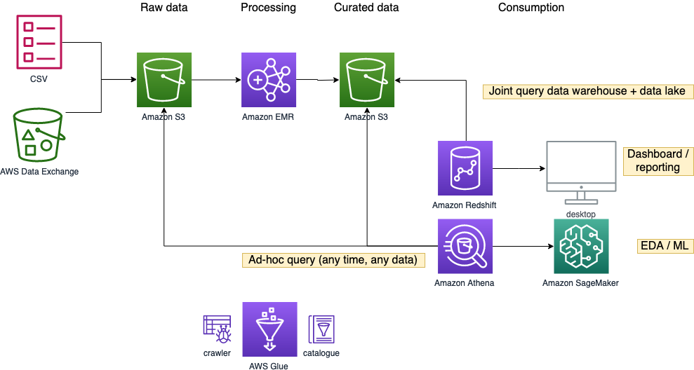
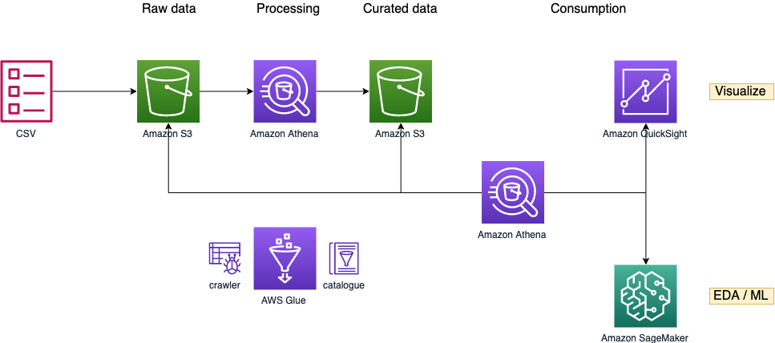
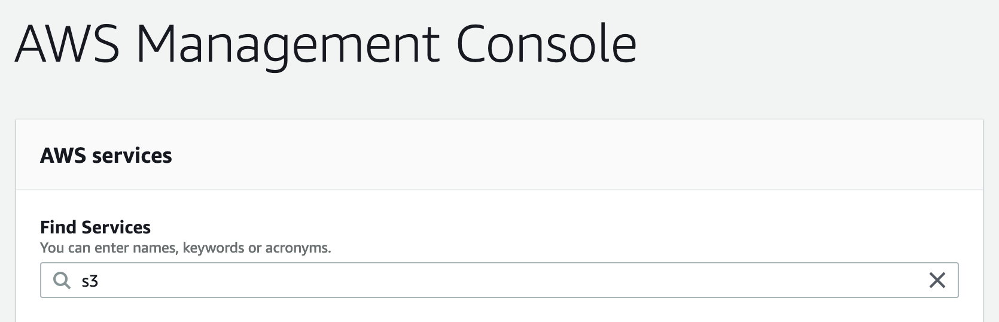
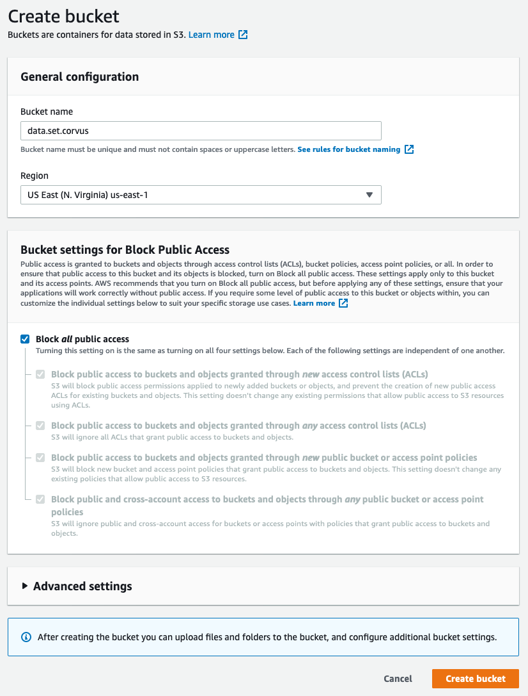

- [Full version](#full-version)
- [Condensed version](#condensed-version)
- [Preparation](#preparation)
  - [Create S3 buckets](#create-s3-buckets)
  - [Create EC2 keypair](#create-ec2-keypair)

# Full version 

> Go through all pages from 02-raw data storage to 10-ml autopilot

In this lab, you will:
* **Catalog** the Amazon Customer Reviews Dataset (32GB gzip compressed) in TSV format using AWS Glue
* Perform **ad-hoc query** using Amazon Athena
* **Data processing** with Spark in Amazon EMR or SQL in Amazon Athena
* Create a single view in a **data warehouse** (with product dimension) with Amazon Redshift integrating the reviews data
* **Build and deploy a machine learning model** to predict the product star rating using Amazon SageMaker Autopilot

# Condensed version

> Go through the following pages:
> * [02-raw data storage](02_raw_data_storage.md)
> * [03-catalogue raw](03_catalogue_raw.md)
> * [04-quick look at raw data](04_quick_look_raw_data.md)
> * [05c-processing athena](05c_processing_athena.md)
> * [07-quick look at curated data](07_quick_look_curated_data.md)
> * 11-visualize quicksight

In this lab, you will:
* **Catalog** the Amazon Customer Reviews Dataset (32GB gzip compressed) in TSV format using AWS Glue
* Perform **ad-hoc query** using Amazon Athena
* **Data processing** with SQL in Amazon Athena
* **Visualize** the data using Amazon QuickSight

# Preparation

> Please use Chrome or Firefox browser to ensure smooth lab experience

* Sign in to the AWS Management Console using the provided credentials
* Make sure you are using the `us-east-1` region for the whole workshop

## Create S3 buckets

1. Click **Create bucket**
   * Bucket name: *s3://data.set.yourname*
   * Region: *us-east-1*
  

## Create EC2 keypair

1. Go to the [EC2 console](https://console.aws.amazon.com/ec2/v2/home) 
2. Under **Network & Security**, click **Key Pairs**
3. Click **Create key pair**
   * Name: *yourname*
   * File format: *pem* 