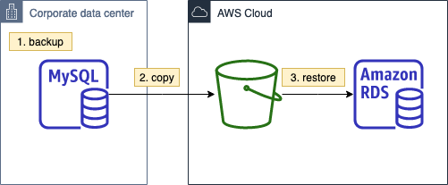

Steps to migrate from on-premise MySQL community edition to RDS MySQL, using Percona XtraBackup. This is the recommended method if the system downtime is long enough (e.g., several hours) to cover 1) backup creation, 2) transfer to S3, and 3) restore to a RDS MySQL instance.



To reduce downtime, we can setup binlog replication to catch up the changes after the restore to RDS MySQL (not illustrated here).

- [1. Preparing source DB](#1-preparing-source-db)
  - [1.1. Install the yum repo](#11-install-the-yum-repo)
  - [1.2. MySQL community edition](#12-mysql-community-edition)
  - [1.3. Populate with Dummy Data](#13-populate-with-dummy-data)
- [2. Preparing source DB backup](#2-preparing-source-db-backup)
  - [2.1 Full backup](#21-full-backup)
  - [2.2 Upload backup to S3](#22-upload-backup-to-s3)
- [3. Create database by restoring from S3](#3-create-database-by-restoring-from-s3)


# 1. Preparing source DB 

> Check which MySQL versions (x.x.xx, including minor version number) are supported in RDS - [doc](https://docs.aws.amazon.com/AmazonRDS/latest/UserGuide/CHAP_MySQL.html#MySQL.Concepts.VersionMgmt)
>
> Using `5.7.26` here as an example

## 1.1. Install the yum repo

Latest version: https://dev.mysql.com/downloads/repo/yum/


```
wget https://dev.mysql.com/get/mysql80-community-release-el7-3.noarch.rpm
sudo yum install ./mysql80-community-release-el7-3.noarch.rpm
```

Switch to 5.7 branch
```
sudo yum-config-manager --disable mysql80-community
sudo yum-config-manager --enable mysql57-community
```

## 1.2. MySQL community edition

Install
```
sudo yum install mysql-community-server-5.7.26
```

Start
```
sudo systemctl start mysqld
```

Get temporary password
```
sudo grep password /var/log/mysqld.log 
```

Secure the database
```
sudo mysql_secure_installation
```

Enable MySQL native password
```sql
alter user 'root'@'localhost' identified with mysql_native_password by 'verystrongpassword';
```

## 1.3. Populate with Dummy Data

> Reference: https://github.com/aws-samples/amazon-aurora-mysql-sample-hr-schema

```
mysql -u root -p < hr-schema.sql 
```

# 2. Preparing source DB backup

Download and install Percona XtraBackup at https://www.percona.com/downloads/. Use version 2.4 for MySQL 5.6 & 5.7, and version 8.0 for MySQL 8.0.

> Using MySQL 5.7.26 here

```
wget https://www.percona.com/downloads/Percona-XtraBackup-2.4/Percona-XtraBackup-2.4.20/binary/redhat/7/x86_64/percona-xtrabackup-24-2.4.20-1.el7.x86_64.rpm

sudo yum install percona-xtrabackup-24-2.4.20-1.el7.x86_64.rpm 
```

## 2.1 Full backup

Backup into multiple xbstream files (500MB each)

```
xtrabackup --backup --user=<myuser> --password=<password> --stream=xbstream \
   --target-dir=/upload_to_s3/hr/ | split -d --bytes=500MB \
   - /upload_to_s3/hr/fullbackup.xbstream
```

Make sure the file extension is correct
```
-rw-r--r-- 1 root root 26M Oct 14 03:44 fullbackup.xbstream00
```

## 2.2 Upload backup to S3

```
aws s3 cp /upload_to_s3/ s3://<your_s3_bucket>/ --recursive
```

# 3. Create database by restoring from S3

1. Go to the [RDS console](https://console.aws.amazon.com/rds/home)
2. Click **Databses** in the manual
3. Click **Restore from S3**
   * S3 destination
     * S3 bucket: *s3 bucket with the xbstream file*
     * S3 prefix: *hr*
   * Engine options
     * Engine type: *MySQL* (may select Aurora here)
     * Engine version: *5.7*
   * IAM role
     * Create a new role
   * Settings
     * Update the DB name and credentials
   * DB instance size
     * Select the required size (e.g., t3.medium)
   * Storage
     * Select the required storage (e.g., general purpose 20GB)
   * Availability
     * Select whether multi-AZ is needed (e.g., no)
   * Connectivity
     * Fill in as required
   * Additional configuration
     * Fill in as required (e.g., export all logs to CloudWatch)
4. Click **Create database**

