Development workloads are often *intermittent* and *unpredictable*. Aurora serverless can automatically start up, shutdown and scale, which is simple and and cost-effective. We can easily deploy the database as provisioned mode to take advantage of additional availability features for production workload, by simply taking a snapshot and restore.

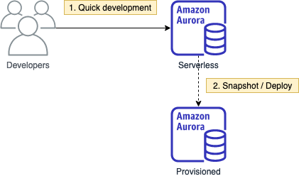

- [Quick Development](#quick-development)
  - [Provision a serverless Aurora cluster](#provision-a-serverless-aurora-cluster)
  - [Prepare client environment and connectivity](#prepare-client-environment-and-connectivity)
    - [AWS Cloud9](#aws-cloud9)
    - [Security group](#security-group)
    - [Connect with MySQL client](#connect-with-mysql-client)
  - [Insert sample data](#insert-sample-data)
- [Deploy to provisioned mode](#deploy-to-provisioned-mode)
  - [Add a read replica for high availability](#add-a-read-replica-for-high-availability)
- [Explore availability features](#explore-availability-features)
- [Operations](#operations)
  - [CloudWatch metrics](#cloudwatch-metrics)
  - [Performance insight](#performance-insight)

# Quick Development
## Provision a serverless Aurora cluster

1. Go to the [RDS console](https://console.aws.amazon.com/rds/home) and click **Create database**
2. Engine options
   * Amazon Aurora
   * MySQL compatibility
   * Capacity type: *Serverless*
   * Version: *5.6.10a*
3. Database features: *serverless*
4. Templates: *Dev/test*
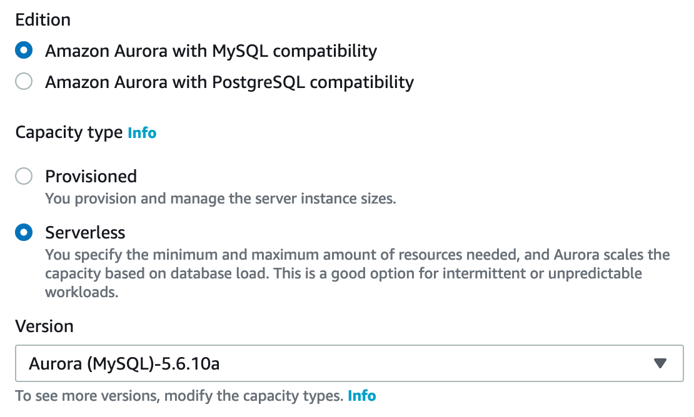
5. Settings
   * Cluster identifier: *dev*
   * Credentials: *(your own password)*
6. Capacity settings
   * Aurora capacity unit: *1 - 4*
   * Force scaling when timeout: *True*
   * Pause after *5* minutes of inactivity
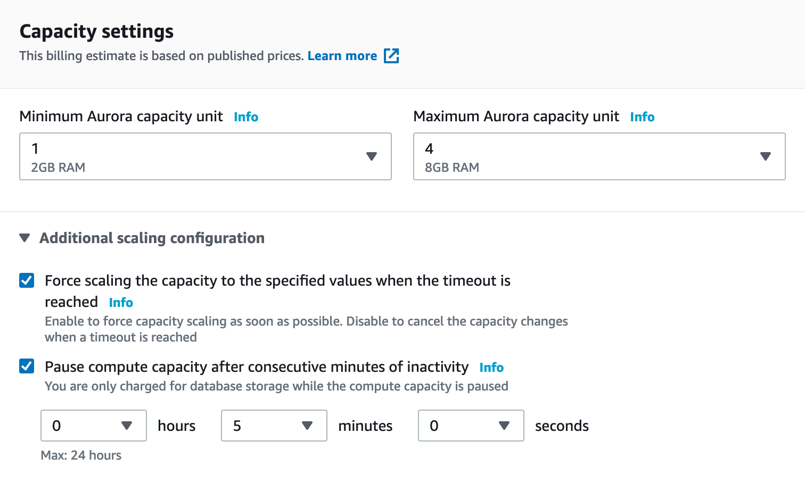
7. Connectivity
   * VPC: *default*
   * Subnet group: *default*
   * Security group: *default*
   * Data API: *True*
8. Click **Create database**

## Prepare client environment and connectivity

### AWS Cloud9

1. Go to the [Cloud9 console](https://console.aws.amazon.com/cloud9/home)
2. Click **Create environment**
3. Name: *dev*
4. Leave everything else default, and click **Create environment**

### Security group

1. When the Cloud9 IDE is ready, go to the [VPC console](https://console.aws.amazon.com/vpc/home)
2. On the left navigation menu, under Security, click **Security groups**
3. Click on the **security group ID** with the group name **default**
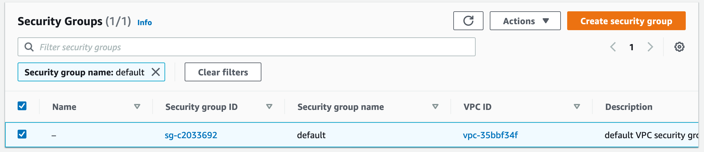
4. Click **Edit inbound rules**
5. Click **Add rule**
   * Type: All traffic (use a more restrictive rule in your own environment)
   * Source: type *cloud9* and **select** the only group that pops up
   * Click **Save rules**
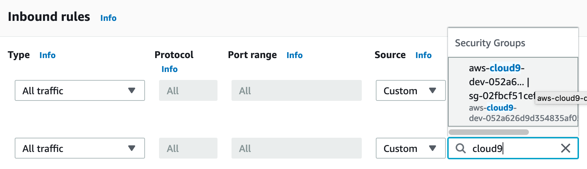

### Connect with MySQL client

1. Go back to the Cloud9 IDE
2. Click **Window > New terminal**

```sql
mysql -h <aurora cluster endpoint> -u admin -p

# may need to wait a bit if the cluster went asleep after 5 minutes of inactivity

mysql> select version();
+-----------+
| version() |
+-----------+
| 5.6.10    |
+-----------+
1 row in set (0.00 sec)
```

## Insert sample data

```sql
CREATE database tutorial;
USE tutorial;
CREATE TABLE planet (
  id INT UNSIGNED AUTO_INCREMENT,
  name VARCHAR(30),
  PRIMARY KEY(id));
INSERT INTO planet (name) VALUES ("Mercury");
INSERT INTO planet (name) VALUES ("Venus");
INSERT INTO planet (name) VALUES ("Earth");
INSERT INTO planet (name) VALUES ("Mars");
INSERT INTO planet (name) VALUES ("Jupiter");
INSERT INTO planet (name) VALUES ("Saturn");
INSERT INTO planet (name) VALUES ("Uranus");
INSERT INTO planet (name) VALUES ("Neptune");
```

> Reference: https://github.com/aws-samples/amazon-elasticache-samples/blob/master/database-caching/seed.sql

```sql
SELECT * from tutorial.planet;
```

```
+----+---------+
| id | name    |
+----+---------+
|  1 | Mercury |
|  2 | Venus   |
|  3 | Earth   |
|  4 | Mars    |
|  5 | Jupiter |
|  6 | Saturn  |
|  7 | Uranus  |
|  8 | Neptune |
+----+---------+
```

# Deploy to provisioned mode

Assume that we are satisfied with the development database, we can deploy it to provisioned mode which offers more availability features, by using snapshot and restore.

1. Go back to the RDS console and select the serverless dev database
2. Click **Action > Take snapshot**
3. Refresh the page and the snapshot will be ready in a minute
4. Select the newly created snapshot, and click **Actions > Restore snapshot**
   * DB specifications:
     * Capacity type: *Provisioned*
     * Replication feature: *Single-master*
     * Engine version: *unchanged*
   * DB instance identifier: *prod*
   * Connectivity: *unchanged* (we keep the same VPC here, but you may want to select other VPC for actual workload)
   * DB instance size: *r5.large*
   * Additional configurations
     * Enable backtrack: 24 hours
     * Select all log exports: audit, error, general, slow query log
   * Click **Restore DB instance**

> **Advanced discussions**:
> 
> While waiting, go back to the snapshots page and explore different actions
> 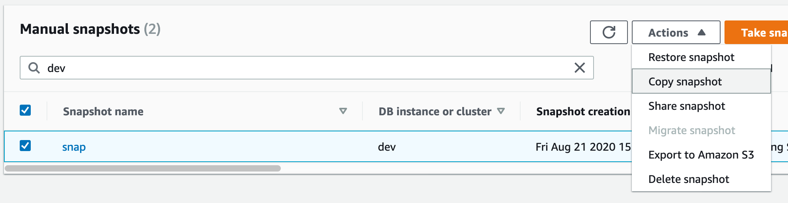
> * **Copy snapshot** - by copying the backup data to another region, this provides a cost effective method for cross-region disaster recovery. 
> * **Export to Amazon S3** ([region availability](https://docs.aws.amazon.com/AmazonRDS/latest/AuroraUserGuide/USER_ExportSnapshot.html)) - by extracting data from the backup snapshot to S3 as parquet files, this enables a simple way to populate the data lake ([reference architecture](https://aws-reference-architectures.gitbook.io/datalake/)). The data are directly consumable by query services like Amazon Athena.

## Add a read replica for high availability

A read replica can help scaling read operations and increasing availability (failover) as illustrated in the diagram below

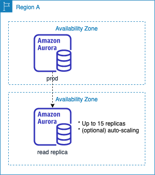

1. Select the Aurora cluster
2. Click **Action** > **Add Reader**
   * DB instance identifier: *prod-rr*
   * DB instance size: *r5.large*
   * Connectivity: *unchanged*
   * Database authentication: *unchanged*
   * Additional configuration: **Enable** enhanced monitoring 
3. Click **Add reader**
4. Note that the two nodes sit in different AZ

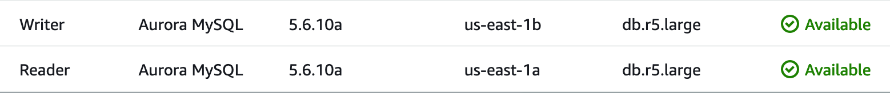

5. To trigger a failover, select a node, click **Action** > **Failover**
6. Refresh the browser page after 10 seconds and check the status

> **Advanced discussion**: 
>
> Check the Aurora failover time under different scenarios at https://aws.amazon.com/blogs/database/improving-application-availability-with-amazon-rds-proxy/

# Explore availability features

> Browse through the console and check how to perform the following actions:

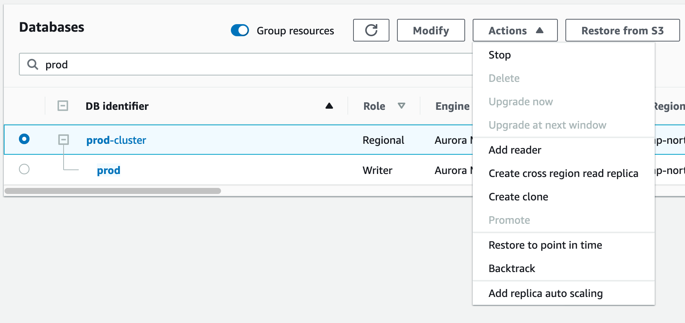

* **Backtrack** - rewinding the database in place
* **Create clone** - in just a few minutes
* **Restore to point in time** - RPO: 5 minutes
* **Create cross region read replica**

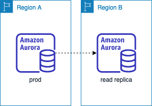

> **Question**: What are the differences between cross-region read replica and cross-region copy snapshot? Think about the RTO and RPO.

# Operations

> Browse through the console and check how to perform the following actions:

* Review the cluster maintenance window - when items like OS or DB patching will happen. To know more check the [doc](https://docs.aws.amazon.com/AmazonRDS/latest/AuroraUserGuide/USER_UpgradeDBInstance.Maintenance.html)
  * required - can be deferred temporarily
  * available - can be deferred indefinitely
  * next window

## CloudWatch metrics

Browse to the **Monitoring** tab and check
* CPU
* DB connections
* R/W IOPS
* Replication lag

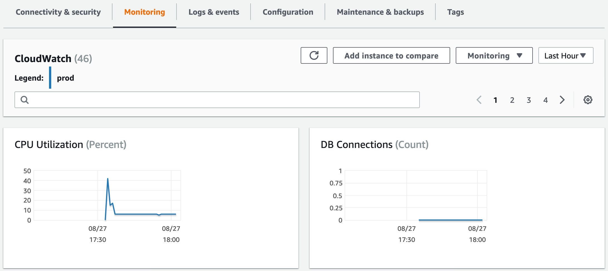

## Performance insight

> Illustrate your database's performance and help you analyze any issues that affect it.

[](
https://www.youtube.com/watch?v=4462hcfkApM&feature=youtu.be&t=22)
