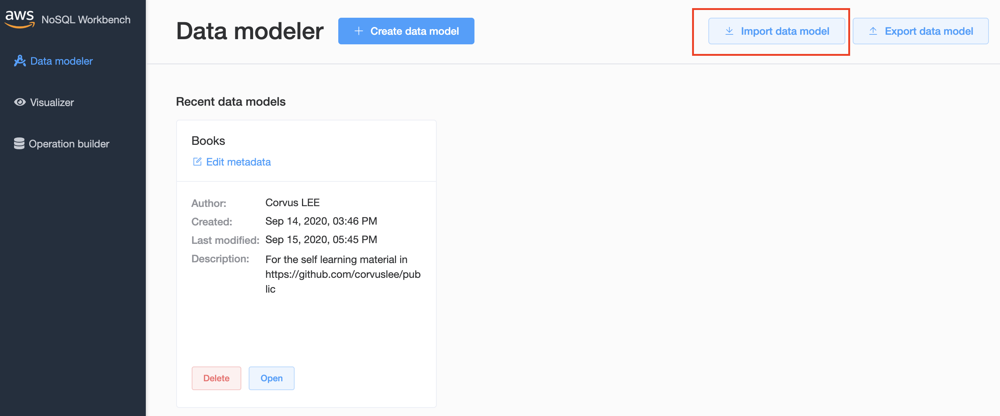
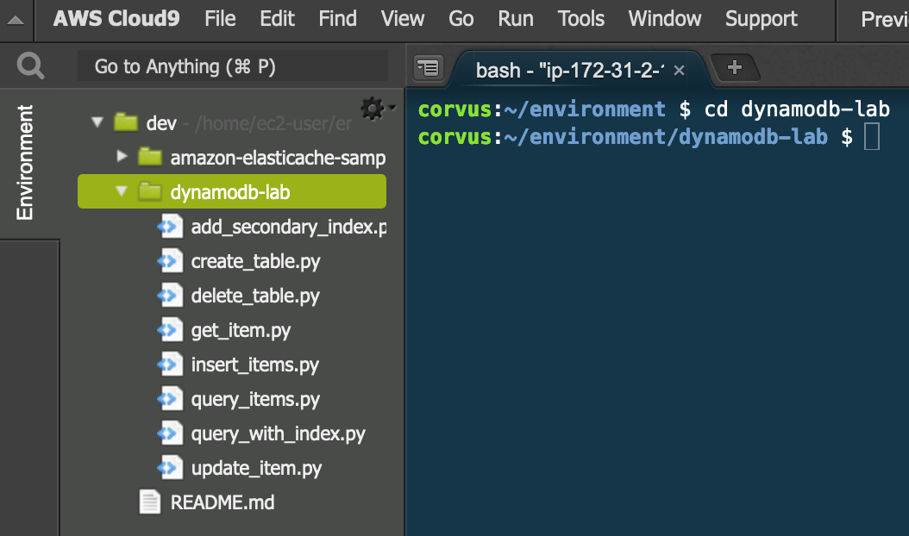
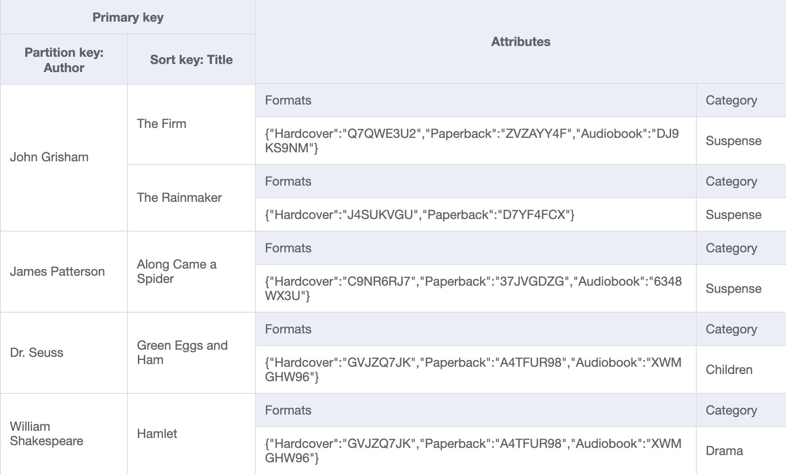
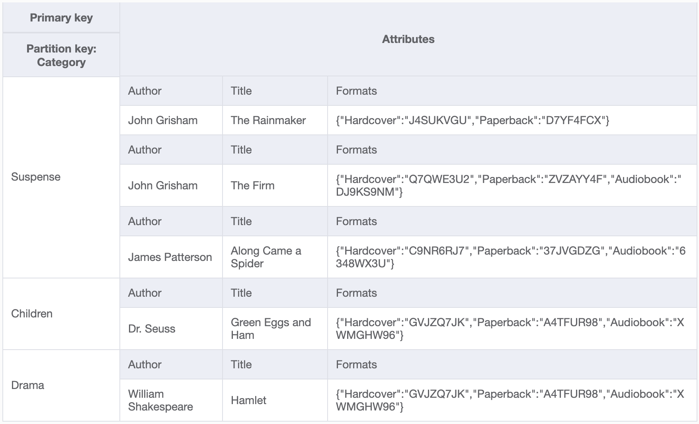

Other than using Amazon Aurora as durable storage and Amazon ElastiCache as shown in [ElastiCache lab](../elasticache/), a common architecture is using Amazon DynamoDB -- A serverless NoSQL database service.

- [Prerequisite](#prerequisite)
- [NoSQL Workbench (optional)](#nosql-workbench-optional)
- [Introduction](#introduction)
- [1. Application background](#1-application-background)
- [2. Inserting and retrieving data](#2-inserting-and-retrieving-data)
  - [2.1 Create table](#21-create-table)
  - [2.2 Insert items](#22-insert-items)
- [3. Querying and global secondary indexes (GSI)](#3-querying-and-global-secondary-indexes-gsi)
  - [3.1 Query - retrieve multiple items by partition key](#31-query---retrieve-multiple-items-by-partition-key)
  - [3.2 GSI](#32-gsi)
- [4. Updating items](#4-updating-items)
- [5. Next steps](#5-next-steps)

# Prerequisite

Provisioned the Cloud9 environment in the [Aurora lab](../aurora/)

# NoSQL Workbench (optional)

We are using [NoSQL Workbench for DynamoDB](https://docs.aws.amazon.com/amazondynamodb/latest/developerguide/workbench.html) to visualize the data model. Download the sample data model as raw file from [here](Books.json) and import into the tools. This step is optional as the screenshots are attached here.

# Introduction

1. Go to the [introduction page](https://aws.amazon.com/getting-started/hands-on/create-manage-nonrelational-database-dynamodb/)
2. Get familiar with the scenario - building an online bookstore application

# 1. Application background

1. Go to [module 1](https://aws.amazon.com/getting-started/hands-on/create-manage-nonrelational-database-dynamodb/2/)
2. Understand the background is important. We need to design the data model accordingly so that the writes are efficient, and at the same time supporting required access patterns

> Patterns described in the page:
> 1. Retrieving a book by its **title** and **author**
> 2. Browse all books in a **category**
> 3. Add/remove **format** for a book (e.g., hardcover, paperback, audiobook)

3. In the Cloud9 IDE, create a new directory (`~/environment/dynamodb-lab`), to not mixing up wit the previous labs
4. Follow step 3 in the page to download supporting code

# 2. Inserting and retrieving data

## 2.1 Create table

1. Go to [module 2](https://aws.amazon.com/getting-started/hands-on/create-manage-nonrelational-database-dynamodb/3/)
2. Understand the terminology: `table`, `item`, `attribute`, simple and composite `primary key`
3. Read carefully the data model section
4. Instead of running `create_table.py` script, we can create the table manually
   1. Go to the [DynamoDB console](https://console.aws.amazon.com/dynamodb/home)
   2. Click **Create table**
      * Table name: *Books*
      * Partition key: *Author* - String
      * Sort key: *Title* - String
      * Table settings: uncheck *use default settings*
      * Read/write capacity mode: *On-demand*
      * Click **Create**

> Optional: Understand the difference between **On-demand** mode and **Provisioned model** - [doc](https://docs.aws.amazon.com/amazondynamodb/latest/developerguide/HowItWorks.ReadWriteCapacityMode.html)

## 2.2 Insert items

1. Load items into the table by issuing the `insert_items.py` script in Cloud9

> Note how additional attributes: Category - `String` and Formats - `Map` can be added during the insert

5. To retrieve a single item, we need to specify the primary key. Try the script `get_item.py` in Cloud9

> Note that our current data model does not do well for access pattern #2 yet, as the Category attribute is not part of the primary key.

# 3. Querying and global secondary indexes (GSI)

Go to [module 3](https://aws.amazon.com/getting-started/hands-on/create-manage-nonrelational-database-dynamodb/4/)

## 3.1 Query - retrieve multiple items by partition key

Note how the script `query_items.py` query all books from a specific author

## 3.2 GSI

1. To support using the attribute **Category** for query, we can create a GSI. Issue the script `add_secondary_index.py`
2. Note how the GSI has a different partition key, and the original primary keys become attributes

3. Now we can query all items with the category **Suspense** using the newly created GSI with the script `query_with_index.py`

# 4. Updating items

1. Go to [module 4](https://aws.amazon.com/getting-started/hands-on/create-manage-nonrelational-database-dynamodb/5/)
2. Understand the usage of UpdateItem API and the script `update_item.py`

# 5. Next steps

If you have time, go to [module 5](https://aws.amazon.com/getting-started/hands-on/create-manage-nonrelational-database-dynamodb/6/) and read the additional resources