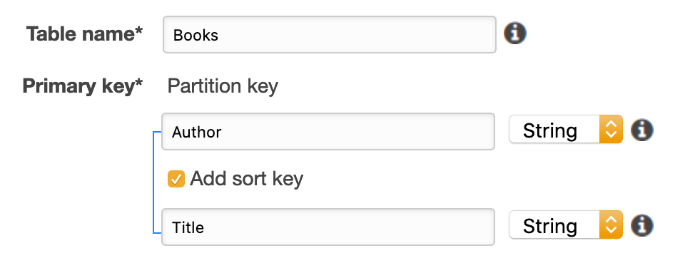
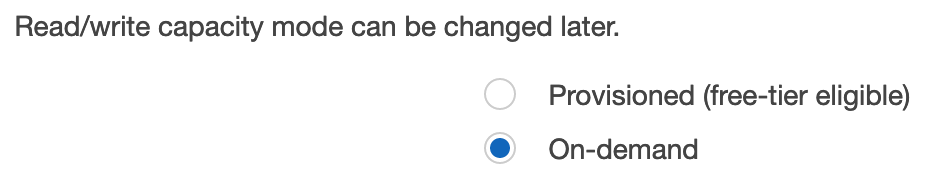
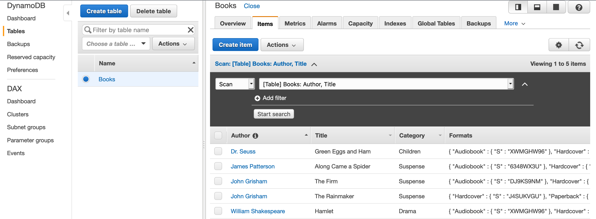
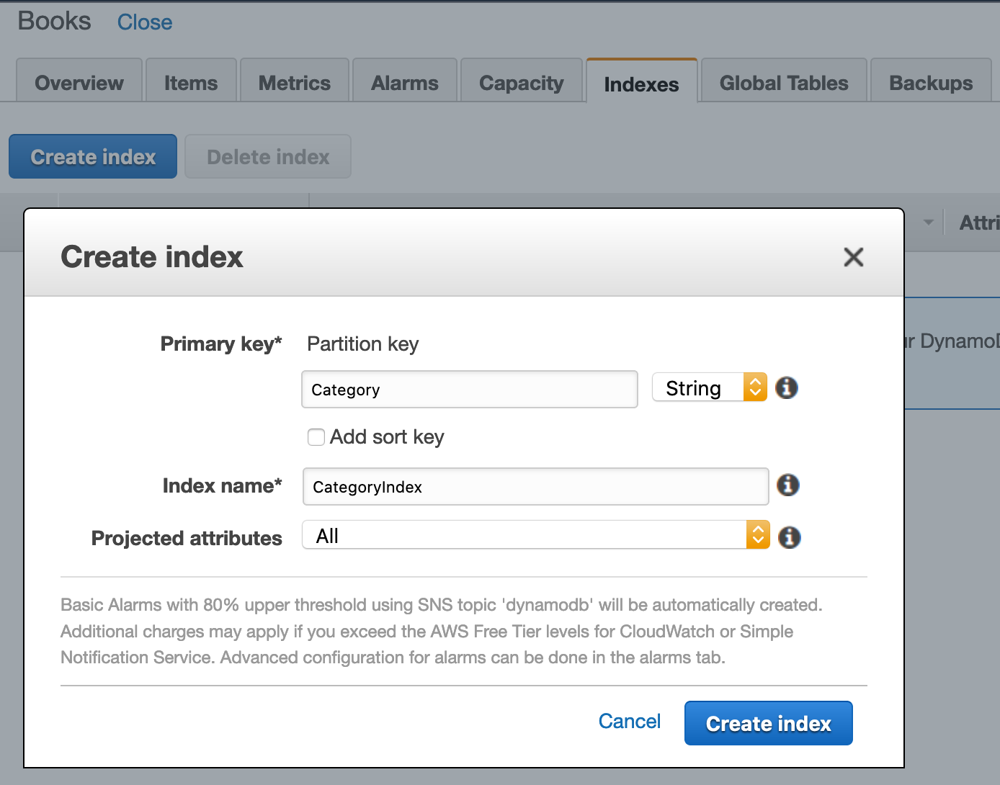
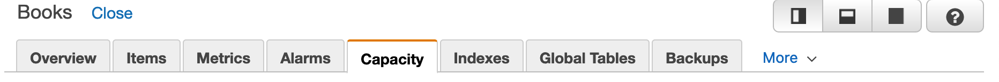

Other than using Amazon Aurora as durable storage and Amazon ElastiCache as shown in [previous lab](../elasticache/), a common architecture is using Amazon DynamoDB -- A serverless NoSQL database service. The focus here is to understand the NoSQL data modelling with reference to the application query pattern.

- [Prerequisite](#prerequisite)
  - [NoSQL Workbench (optional)](#nosql-workbench-optional)
- [Introduction](#introduction)
- [Data modelling](#data-modelling)
  - [1. Application background](#1-application-background)
  - [2. Inserting and retrieving data](#2-inserting-and-retrieving-data)
    - [2.1 Create table](#21-create-table)
    - [2.2 Insert items](#22-insert-items)
    - [2.3 Get a single item by primary key](#23-get-a-single-item-by-primary-key)
  - [3. Querying and global secondary indexes (GSI)](#3-querying-and-global-secondary-indexes-gsi)
    - [3.1 Query - retrieve multiple items by partition key](#31-query---retrieve-multiple-items-by-partition-key)
    - [3.2 GSI](#32-gsi)
- [Operations](#operations)

# Prerequisite

Provisioned the Cloud9 environment in the [Aurora lab](../aurora/)

## NoSQL Workbench (optional)

We are using [NoSQL Workbench for DynamoDB](https://docs.aws.amazon.com/amazondynamodb/latest/developerguide/workbench.html) to visualize the data model. Download the sample data model from [here](Books.json) (open the page, right click on "raw" and save the file) and import into the tools. This step is optional as screenshots will be attached.


# Introduction

1. Go to the [introduction page](https://aws.amazon.com/getting-started/hands-on/create-manage-nonrelational-database-dynamodb/)
2. Get familiar with the scenario - building an online bookstore application

# Data modelling

## 1. Application background

1. Go to [module 1](https://aws.amazon.com/getting-started/hands-on/create-manage-nonrelational-database-dynamodb/2/) and read the background. No need to run the steps in the page there.
2. We need to design the data model accordingly so that the writes are efficient, and at the same time supporting required access patterns

> Patterns described in the page:
> 1. Retrieving a book by its **title** and **author**
> 2. Browse all books in a **category**
> 3. Add/remove **format** for a book (e.g., hardcover, paperback, audiobook)

1. In the Cloud9 IDE, create a new directory (`~/environment/dynamodb-lab`), so that we will not mix up with the previous labs
2. Download supporting code

```
curl -sL https://s3.amazonaws.com/ddb-deep-dive/dynamodb.tar | tar -xv
```

3. If not in **us-east-1** region, replace the value with your region (e.g., **us-west-2**)

```
export region=<your region>
sed -i ".bak" "s/us-east-1/$region/g" *.py
```

4. Install the latest boto3 library

```
sudo pip install boto3
```


## 2. Inserting and retrieving data

### 2.1 Create table

1. Go to [module 2](https://aws.amazon.com/getting-started/hands-on/create-manage-nonrelational-database-dynamodb/3/)
2. Understand the terminology: `table`, `item`, `attribute`, simple and composite `primary key`
3. Read carefully the data model section
4. Instead of running `create_table.py` script, we can create the table manually
   1. Go to the [DynamoDB console](https://console.aws.amazon.com/dynamodb/home)
   2. Click **Create table**
      * Table name: *Books*
      * Partition key: *Author* - String
      * Sort key: *Title* - String

      

      * Table settings: uncheck *use default settings*
      * Read/write capacity mode: *on-demand*
      * Click **Create**

      

> **Advanced discussion**:
>
> The table just created will auto adapt to bursty, new, or unpredictable workloads which traffic can spike in seconds or minutes. The default provision mode will be more suitable for applications which auto-scale gradually.

### 2.2 Insert items

1. Load items into the table by issuing the `insert_items.py` script in Cloud9

```
python insert_items.py
```

In the console, check that we have inserted 5 new items into the Books table


> Note that DynamoDB is schemaless, and additional attributes: Category - `String` and Formats - `Map` can be added during insert

The data model illustrated in NoSQL Workbench:


### 2.3 Get a single item by primary key

To retrieve a single item, we need to specify the primary key. Try the script `get_item.py` in Cloud9

```
python get_item.py
```

> Note that our current data model does not do well for access pattern #2 -- browse all books in a category -- yet, as the Category attribute is not part of the primary key.

## 3. Querying and global secondary indexes (GSI)

Go to [module 3](https://aws.amazon.com/getting-started/hands-on/create-manage-nonrelational-database-dynamodb/4/)

### 3.1 Query - retrieve multiple items by partition key

Note how the script `query_items.py` query all books from a specific author

```
python query_items.py
```

### 3.2 GSI

1. To support using the attribute **Category** for query, we can create a GSI in the console.
   * Partition key: *Category*
   * Sort key: *none* (default)
   * Index name: *CategoryIndex* <- not the default one
   * Projected attributes: *all* (default)



2. Note how the GSI has a different partition key, and the original primary keys become attributes


3. Now we can query all items with the category **Suspense** using the newly created GSI with the script `query_with_index.py`

```
python query_with_index.py
```

# Operations

> Browse the console and see how to perform the following actions



* Backups - restore point in time to a new table in the same or different region
* Capacity - switch between provisioned and on-demand once every 24 hours
* Metrics
  * (Provisioned mode) `ConsumedReadCapacityUnits`/`ConsumedWriteCapacityUnits`
  * (Provisioned mode) `ThrottledRequests`
  * `SystemErrors`

> DynamoDB replicate synchronously to three AZs automatically