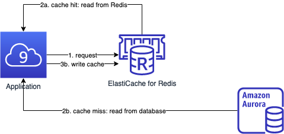
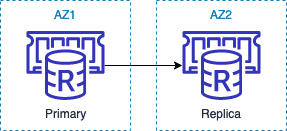
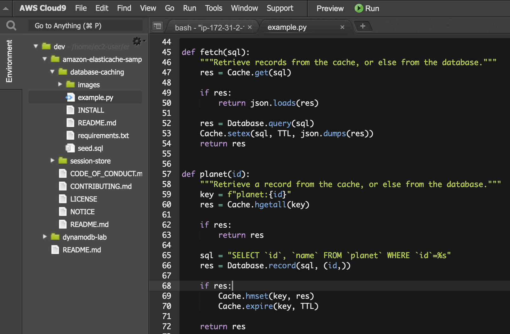
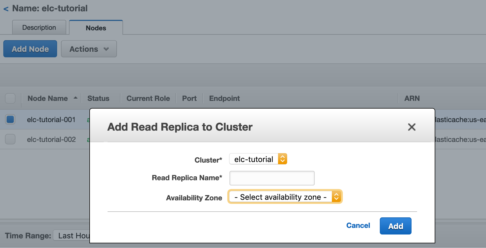
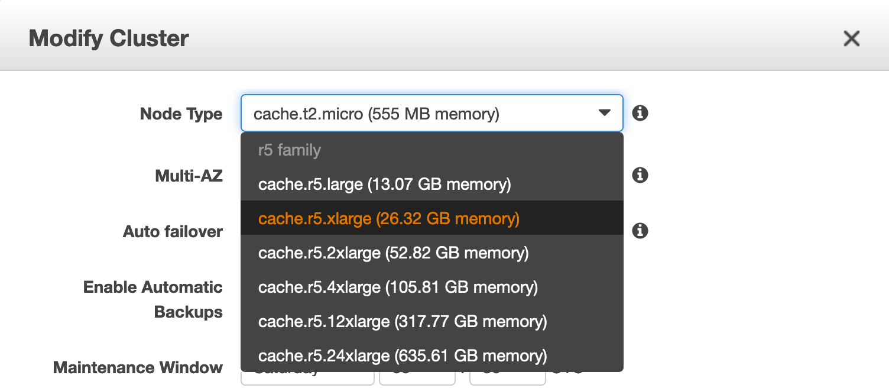

A common architecture is using Amazon Aurora as durable storage and cache-aside with Amazon ElastiCache for Redis. In this lab, we will walk through the application code using a Redis client in Python.



- [Prerequisite](#prerequisite)
- [Introduction](#introduction)
- [Provisioning](#provisioning)
  - [1. Create a Redis cluster](#1-create-a-redis-cluster)
  - [2. Create a MySQL database](#2-create-a-mysql-database)
  - [3. Populate the MySQL database](#3-populate-the-mysql-database)
- [Code walkthrough](#code-walkthrough)
  - [1. Test connection](#1-test-connection)
  - [2. Configure environment variables](#2-configure-environment-variables)
  - [3. Run and review the sample code](#3-run-and-review-the-sample-code)
- [Operations](#operations)

# Prerequisite

Finished the [Aurora lab](../aurora/)

# Introduction

1. Go to the [introduction page](https://aws.amazon.com/getting-started/hands-on/boosting-mysql-database-performance-with-amazon-elasticache-for-redis/)
2. Understand the learning goal
3. Skip the "Prerequisite" session in the webpage. Instead run the following commands in our Cloud9 IDE

```
git clone https://github.com/aws-samples/amazon-elasticache-samples/
```
```
cd amazon-elasticache-samples/database-caching
```
```
pip install -r requirements.txt --user
```

> **Question**: In what scenarios should we choose Aurora read replica or ElastiCache for Redis? Think about what will be stored in both data stores.

# Provisioning

## 1. Create a Redis cluster

Go to [step 1](https://aws.amazon.com/getting-started/hands-on/boosting-mysql-database-performance-with-amazon-elasticache-for-redis/1/) in the page and follow the instructions

> **Security group**: use the *default*, which is also assigned to our Aurora cluster



## 2. Create a MySQL database

**Skip** this section. Done in previous lab

## 3. Populate the MySQL database

**Skip** this section. Done in previous lab

# Code walkthrough

Go to [step 4](https://aws.amazon.com/getting-started/hands-on/boosting-mysql-database-performance-with-amazon-elasticache-for-redis/4/) and follow the instruction from 4.1 - 4.3

> Tips:
> * Run the commands in Cloud9 instead of EC2 instance
> * In Cloud9 press `Ctrl+N` and copy/paste/edit the Python and shell scripts

## 1. Test connection

Enter the Python interpreter

\# Shell
```
python
```

Replace the value of *your_redis_endpoint* and paste the code in the Python interpreter

\# Python
```py
import redis
client = redis.Redis.from_url('redis://your_redis_endpoint:6379')
client.ping()
```

## 2. Configure environment variables

Replace with the actual values in the follow code, then paste into the shell

\# Shell
```sh
export REDIS_URL=redis://your_redis_endpoint:6379/
export DB_HOST=the_prod_aurora_endpoint
export DB_USER=admin
export DB_PASS=your_admin_password
export DB_NAME=tutorial
```

## 3. Run and review the sample code

\# Shell
```
python ~/environment/amazon-elasticache-samples/database-caching/example.py
```

Double click `example.py` to open the code in Cloud9


> **Code review**
> 
> The [page](https://aws.amazon.com/getting-started/hands-on/boosting-mysql-database-performance-with-amazon-elasticache-for-redis/4/) has detailed explanation of the code, and here are the summary:
> 
> * Cache the result of a SQL query:
>   * [GET](https://redis.io/commands/get)
>   * [SETEX](https://redis.io/commands/setex)
> * Cache a record as a Redis hash:
>   * [HGETALL](https://redis.io/commands/hgetall)
>   * [HGET](https://redis.io/commands/hget)
>   * [HMSET](https://redis.io/commands/hmset)

# Operations

> Browse the console and see how to perform the following actions

* [Applying service update](https://docs.aws.amazon.com/AmazonElastiCache/latest/red-ug/applying-updates.html)
* Scale-out to handle read workloads (up to five read replicas)

* [Scale-up to handle write workloads](https://docs.aws.amazon.com/AmazonElastiCache/latest/red-ug/Scaling.RedisReplGrps.html)

* [Replicate across regions using global datastore](https://docs.aws.amazon.com/AmazonElastiCache/latest/red-ug/Redis-Global-Datastore.html) - requires R5/M5 instance
* [Monitoring](https://docs.aws.amazon.com/AmazonElastiCache/latest/red-ug/CacheMetrics.WhichShouldIMonitor.html)
  * `CPUUtilization` or `EngineCPUUtilization`
  * `SwapUsage` < 50MB
  * `Evictions`
  * `CurrConnections`
