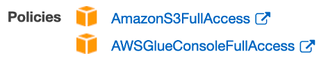
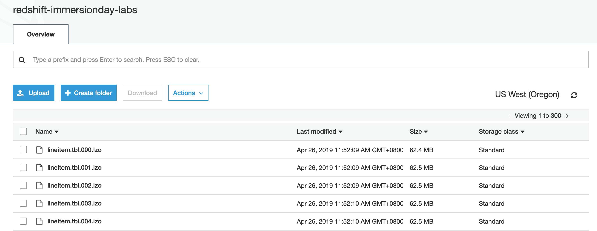

In this task you will provision an Amazon Redshift cluster, and load sample data into a star schema.

- [Provisioning](#provisioning)
- [Data loading](#data-loading)
  - [Create tables](#create-tables)
  - [Data loading](#data-loading-1)
    - [Advanced discussion](#advanced-discussion)
  - [Table maintenance](#table-maintenance)

# Provisioning

1. Create a **service role** in the [IAM Console](https://console.aws.amazon.com/iam/home)
   1.  Click **Roles**
   2.  Click **Create roles**
   3.  Choose the AWS service that will use this role: *Redshift*
       1.  Select your use case: *Redshift – Customizable*
       2.  Click **Next: Permissions**
   4.  Select (checker) the following policies:
       1.  *AmazonS3FullAccess*
       2.  *AWSGlueConsoleFullAccess*
   5.  Click **Next: Tags** and leave the tags blank
   6.  Click **Next: Review** and input the following:
       1.  Role name: *spectrum*
       2.  Role description: *Allows Redshift Spectrum to use Glue catalog and S3*
       3.  Click **Create role**
2.  Provision a data warehouse cluster in the [Redshift Console](https://console.aws.amazon.com/redshiftv2/)
    1.  Click **Create cluster**
        1.  Cluster identifier: *redshift-cluster-1* (default)
        2.  Node type: *dc2.large*
        3.  Nodes: *4*
        4.  Database name: *dev* (default)
        5.  Database port: *5439* (default)
        6.  Master user name: *awsuser* (default)
        7.  Master user password: *yourpassword*
        8.  Expand **Cluster permissions**
            1.  Choose an IAM role: *spectrum*
            2.  Click **Add IAM role**
    2.  Click **Create cluster**
3.  Click **Clusters** and wait until Status becomes *Available*

# Data loading

> For better experience, we may use a SQL client tools, such as SQL Workbench/J, to write and run SQL statements - [doc](https://docs.aws.amazon.com/redshift/latest/mgmt/connecting-using-workbench.html)

## Create tables

1. Open the **query editor**
2. Create a sample star schema (source: https://redshift-immersion.workshop.aws/en/lab2.html)

```sql
DROP TABLE IF EXISTS partsupp;
DROP TABLE IF EXISTS lineitem;
DROP TABLE IF EXISTS supplier;
DROP TABLE IF EXISTS part;
DROP TABLE IF EXISTS orders;
DROP TABLE IF EXISTS customer;
DROP TABLE IF EXISTS nation;
DROP TABLE IF EXISTS region;

CREATE TABLE region (
  R_REGIONKEY bigint NOT NULL PRIMARY KEY,
  R_NAME varchar(25),
  R_COMMENT varchar(152));

CREATE TABLE nation (
  N_NATIONKEY bigint NOT NULL PRIMARY KEY,
  N_NAME varchar(25),
  N_REGIONKEY bigint REFERENCES region(R_REGIONKEY),
  N_COMMENT varchar(152));

create table customer (
  C_CUSTKEY bigint NOT NULL PRIMARY KEY,
  C_NAME varchar(25),
  C_ADDRESS varchar(40),
  C_NATIONKEY bigint REFERENCES nation(N_NATIONKEY),
  C_PHONE varchar(15),
  C_ACCTBAL decimal(18,4),
  C_MKTSEGMENT varchar(10),
  C_COMMENT varchar(117));

create table orders (
  O_ORDERKEY bigint NOT NULL PRIMARY KEY,
  O_CUSTKEY bigint REFERENCES customer(C_CUSTKEY),
  O_ORDERSTATUS varchar(1),
  O_TOTALPRICE decimal(18,4),
  O_ORDERDATE Date,
  O_ORDERPRIORITY varchar(15),
  O_CLERK varchar(15),
  O_SHIPPRIORITY Integer,
  O_COMMENT varchar(79))
sortkey (O_ORDERDATE);

create table part (
  P_PARTKEY bigint NOT NULL PRIMARY KEY,
  P_NAME varchar(55),
  P_MFGR  varchar(25),
  P_BRAND varchar(10),
  P_TYPE varchar(25),
  P_SIZE integer,
  P_CONTAINER varchar(10),
  P_RETAILPRICE decimal(18,4),
  P_COMMENT varchar(23));
  
create table supplier (
  S_SUPPKEY bigint NOT NULL PRIMARY KEY,
  S_NAME varchar(25),
  S_ADDRESS varchar(40),
  S_NATIONKEY bigint REFERENCES nation(n_nationkey),
  S_PHONE varchar(15),
  S_ACCTBAL decimal(18,4),
  S_COMMENT varchar(101));                                      

create table lineitem (
  L_ORDERKEY bigint NOT NULL REFERENCES orders(O_ORDERKEY),
  L_PARTKEY bigint REFERENCES part(P_PARTKEY),
  L_SUPPKEY bigint REFERENCES supplier(S_SUPPKEY),
  L_LINENUMBER integer NOT NULL,
  L_QUANTITY decimal(18,4),
  L_EXTENDEDPRICE decimal(18,4),
  L_DISCOUNT decimal(18,4),
  L_TAX decimal(18,4),
  L_RETURNFLAG varchar(1),
  L_LINESTATUS varchar(1),
  L_SHIPDATE date,
  L_COMMITDATE date,
  L_RECEIPTDATE date,
  L_SHIPINSTRUCT varchar(25),
  L_SHIPMODE varchar(10),
  L_COMMENT varchar(44),
PRIMARY KEY (L_ORDERKEY, L_LINENUMBER))
sortkey (L_RECEIPTDATE);

create table partsupp (
  PS_PARTKEY bigint NOT NULL REFERENCES part(P_PARTKEY),
  PS_SUPPKEY bigint NOT NULL REFERENCES supplier(S_SUPPKEY),
  PS_AVAILQTY integer,
  PS_SUPPLYCOST decimal(18,4),
  PS_COMMENT varchar(199),
PRIMARY KEY (PS_PARTKEY, PS_SUPPKEY));
```

## Data loading

Use the `COPY` command whenever possible, and split the input files into multiple files so that the loading can be done in parallel. For example, we are going to load the `lineitem` table from 300 small files.



```bash
COPY region FROM 's3://redshift-immersionday-labs/data/region/region.tbl.lzo'
iam_role 'arn:aws:iam::[Your-AWS_Account_Id]:role/spectrum'
region 'us-west-2' lzop delimiter '|' ;

COPY nation FROM 's3://redshift-immersionday-labs/data/nation/nation.tbl.'
iam_role 'arn:aws:iam::[Your-AWS_Account_Id]:role/spectrum'
region 'us-west-2' lzop delimiter '|' ;

copy customer from 's3://redshift-immersionday-labs/data/customer/customer.tbl.'
iam_role 'arn:aws:iam::[Your-AWS_Account_Id]:role/spectrum'
region 'us-west-2' lzop delimiter '|' ;

copy orders from 's3://redshift-immersionday-labs/data/orders/orders.tbl.'
iam_role 'arn:aws:iam::[Your-AWS_Account_Id]:role/spectrum'
region 'us-west-2' lzop delimiter '|' ;

copy part from 's3://redshift-immersionday-labs/data/part/part.tbl.'
iam_role 'arn:aws:iam::[Your-AWS_Account_Id]:role/spectrum'
region 'us-west-2' lzop delimiter '|' ;

copy supplier from 's3://redshift-immersionday-labs/data/supplier/supplier.json' manifest
iam_role 'arn:aws:iam::[Your-AWS_Account_Id]:role/spectrum'
region 'us-west-2' lzop delimiter '|' ;

copy lineitem from 's3://redshift-immersionday-labs/data/lineitem/lineitem.tbl.'
iam_role 'arn:aws:iam::[Your-AWS_Account_Id]:role/spectrum'
region 'us-west-2' lzop delimiter '|' ;

copy partsupp from 's3://redshift-immersionday-labs/data/partsupp/partsupp.tbl.'
iam_role 'arn:aws:iam::[Your-AWS_Account_Id]:role/spectrum'
region 'us-west-2' lzop delimiter '|' ;
```

> It will take around 20 minutes to load the tables

### Advanced discussion
While waiting for the data load, discuss some key concepts of Amazon Redshift:
* row-store vs. column store - [doc](https://docs.aws.amazon.com/redshift/latest/dg/c_columnar_storage_disk_mem_mgmnt.html)
* data distribution - [doc](https://docs.aws.amazon.com/redshift/latest/dg/t_Distributing_data.html)
* sort key - [doc](https://docs.aws.amazon.com/redshift/latest/dg/t_Sorting_data.html)

## Table maintenance

While the statistics update and table vacuum have been automated by Amazon Redshift, it is a good practice to manually perform the operation after loading large amount of data.

```
ANALYZE;

VACUUM;
```
