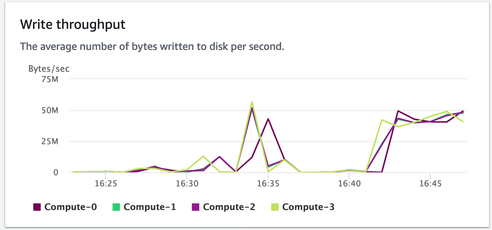

In this task you will explore the Amazon Redshift console and take a look at some common operations.

- [Scaling](#scaling)
- [Backup/restore](#backuprestore)
- [Monitoring](#monitoring)

# Scaling

1. Click **Actions**, then **Resize**
2. With **Elastic resize**, we can
   * Change the number of nodes (scale out/in)
   * Or change the node type and number of nodes
   
   > Note that this can be scheduled as a recurring event

# Backup/restore

1. Click the **backup** tab
2. Notice how we can set the automatic backup retention to up to 35 days
   
3. Amazon Redshift is taking a snapshot about every eight hours, or 5GB per node of data changes.
4. Select the latest snapshot under the **backup** tab
5. Click **Restore from snapshot**
   * This will restore the database to a new cluster

# Monitoring

1. Click the **cluster performance** tab
2. Notice the metrics for CPU utilization and write throughput during our data load
   * Maxed CPU
   
   * Top throughput
   
3. Click the **query monitoring** tab
   * Filter by **Loads**
   