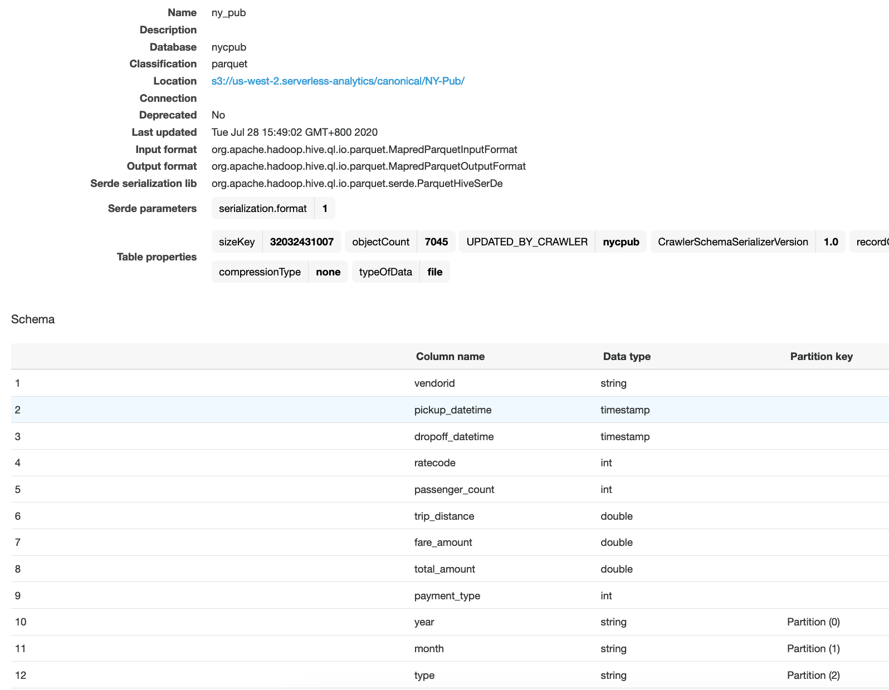

In this lab, you will explore how to utilize Redshift Spectrum to query data across S3 data lake and Amazon Redshift without loading or moving objects. Common use cases include:
* Explore new insights by joining business data (in Amazon Redshift) with event data (in S3 data lake)
* Unload historical data to data lake, keeping a lean data warehouse

Additionally, you will [create a late binding view](https://docs.aws.amazon.com/redshift/latest/dg/r_CREATE_VIEW.html) in Amazon Redshift to union data across data warehouse and data lake to create a single source of truth.

- [Use case 1: Joint analysis with data lake](#use-case-1-joint-analysis-with-data-lake)
  - [Populate Glue data catalogue](#populate-glue-data-catalogue)
  - [Redshift preparation](#redshift-preparation)
    - [External schema](#external-schema)
    - [Dimension table](#dimension-table)
  - [Query the enriched trip data](#query-the-enriched-trip-data)
- [Use case 2: Offload historical data](#use-case-2-offload-historical-data)
  - [Create External Table As Select](#create-external-table-as-select)
  - [Delete offloaded records from Redshift](#delete-offloaded-records-from-redshift)
  - [Create a view as single source of truth](#create-a-view-as-single-source-of-truth)

# Use case 1: Joint analysis with data lake

We will be using [New York City Taxi and Limousine Commission (TLC) Trip Record Data](https://registry.opendata.aws/nyc-tlc-trip-records-pds/), which contain trips taken by taxi and for-hire vehicles in New York City from 2009 - 2016.

Go to the [preprocessed dataset in S3](https://s3.console.aws.amazon.com/s3/buckets/us-west-2.serverless-analytics/canonical/NY-Pub/?region=us-west-2&tab=overview) and note how the data are:
* partitioned by year, month and type (columns that are frequently filtered or grouped)
*  stored in gzipped parquet format

```
aws s3 ls s3://us-west-2.serverless-analytics/canonical/NY-Pub/year=2016/month=1/type=yellow/ --human-readable
2017-05-19 10:43:22    3.4 MiB part-r-03104-6e222bd6-47be-424a-a29a-606961a23de1.gz.parquet
2017-05-19 10:43:23    3.4 MiB part-r-03104-90b05037-c70b-4bc7-978c-b53b496c4751.gz.parquet
2017-05-19 10:43:23    3.2 MiB part-r-03105-6e222bd6-47be-424a-a29a-606961a23de1.gz.parquet
2017-05-19 10:43:23    3.2 MiB part-r-03105-90b05037-c70b-4bc7-978c-b53b496c4751.gz.parquet
2017-05-19 10:43:23    3.5 MiB part-r-03106-6e222bd6-47be-424a-a29a-606961a23de1.gz.parquet
```

## Populate Glue data catalogue

1. Go to the [AWS Glue console](https://console.aws.amazon.com/glue/home)
2. From the navigation menu on the left, click **Crawlers**
3. Click **Add crawler**
   1. Crawler name: *nycpub*
   2. Crawler source type: *data stores* (default)
   3. Data store: *s3* (default)
      1. Include path: *s3://us-west-2.serverless-analytics/canonical/NY-Pub/*
   4. Add another data store: *no* (default)
   5. Create an IAM role: *nycpub-crawler*
   6. Frequency: *run on demand* (default)
   7. Add database: *nycpub*
   8. Click **Finish**
   9.  Select your crawler *nycpub* and click **Run crawler**
   10. The crawler runs for a minute and adds 1 table
4. From the navigation menu, click **Tables** and note the table name `ny_pub`, which is inferred from the S3 folder
   1. The crawler used built-in classifiers and identified the table, inferred the schema (columns/data types), and collected a set of properties.

## Redshift preparation

### External schema

1. Go to the [Amazon Redshift console](https://console.aws.amazon.com/redshiftv2/home)
2. Open the **query editor**
3. Create an external schema and database from the Glue data catalogue
```sql
CREATE external SCHEMA spectrum
FROM data catalog DATABASE 'nycpub'
IAM_ROLE 'arn:aws:iam::[Your-AWS-Account_Id]:role/spectrum'
CREATE external DATABASE if not exists;
```
4. Run a sample query against the S3 data lake
```sql
SELECT TO_CHAR(pickup_datetime, 'YYYY-MM-DD') pickup_date,
COUNT(*)
FROM spectrum.ny_pub
WHERE YEAR = 2016 and Month = 01
GROUP BY 1
ORDER BY 1;
```

### Dimension table

1. Create a sample dimension table for rate code information
```sql
CREATE TABLE public.rate
(
ratecode INT2,
    description VARCHAR(30)
);
```
2. Populate with rate code details
```sql
INSERT INTO public.rate
VALUES (1, 'Standard rate'),
       (2, 'JFK'),
       (3, 'Newark'),
       (4, 'Nassau or Westchester'),
       (5, 'Negotiated fare'),
       (6, 'Group ride');
```

## Query the enriched trip data

Monthly total number of trips for each ratecode
```sql
SELECT year, month, b.description, count(*)
FROM spectrum.ny_pub a
  INNER JOIN public.rate b ON a.ratecode = b.ratecode
GROUP BY a.ratecode,
         b.description,
         year,
         month
;
```

# Use case 2: Offload historical data

The **orders** table contains orders from 1992 to 1998
```sql
select 
  min(o_orderdate) earliest,
  max(o_orderdate) latest
from orders;
```

## Create External Table As Select

Let's keep only latest 5 years in Redshift, and unload the rest to S3 as Parquet files partitioned by year.

> Replace the bucket name in the LOCATION

```sql
CREATE EXTERNAL TABLE spectrum.orders
PARTITIONED BY (year) 
STORED AS parquet
LOCATION 's3://spectrum.yourname/public/orders'
AS
SELECT *, TO_CHAR(o_orderdate, 'YYYY') as year
FROM public.orders
WHERE o_orderdate < '1994-01-01'
```

> In the next offload batch, use [INSERT INTO](https://docs.aws.amazon.com/redshift/latest/dg/r_INSERT_external_table.html) instead.

Cross check the S3 bucket content:
```
$ aws s3 ls s3://spectrum.leesiu/ --recursive --human-readable
2020-07-29 16:05:17   62.2 MiB public/orders/year=1992/20200729_080512_856919_2597_0000_part_00.parquet
2020-07-29 16:05:17   62.2 MiB public/orders/year=1992/20200729_080512_856919_2597_0001_part_00.parquet
2020-07-29 16:05:17   62.1 MiB public/orders/year=1992/20200729_080512_856919_2597_0002_part_00.parquet
2020-07-29 16:05:17   62.2 MiB public/orders/year=1992/20200729_080512_856919_2597_0003_part_00.parquet
2020-07-29 16:05:17   62.1 MiB public/orders/year=1992/20200729_080512_856919_2597_0004_part_00.parquet
2020-07-29 16:05:17   62.1 MiB public/orders/year=1992/20200729_080512_856919_2597_0005_part_00.parquet
2020-07-29 16:05:17   62.2 MiB public/orders/year=1992/20200729_080512_856919_2597_0006_part_00.parquet
2020-07-29 16:05:17   62.1 MiB public/orders/year=1992/20200729_080512_856919_2597_0007_part_00.parquet
2020-07-29 16:05:24   62.0 MiB public/orders/year=1993/20200729_080512_856919_2597_0000_part_00.parquet
2020-07-29 16:05:25   62.0 MiB public/orders/year=1993/20200729_080512_856919_2597_0001_part_00.parquet
2020-07-29 16:05:24   62.0 MiB public/orders/year=1993/20200729_080512_856919_2597_0002_part_00.parquet
2020-07-29 16:05:24   62.0 MiB public/orders/year=1993/20200729_080512_856919_2597_0003_part_00.parquet
2020-07-29 16:05:24   62.0 MiB public/orders/year=1993/20200729_080512_856919_2597_0004_part_00.parquet
2020-07-29 16:05:25   61.9 MiB public/orders/year=1993/20200729_080512_856919_2597_0005_part_00.parquet
2020-07-29 16:05:24   62.0 MiB public/orders/year=1993/20200729_080512_856919_2597_0006_part_00.parquet
2020-07-29 16:05:24   62.0 MiB public/orders/year=1993/20200729_080512_856919_2597_0007_part_00.parquet```
```

## Delete offloaded records from Redshift

```sql
DELETE FROM public.orders
WHERE o_orderdate < '1994-01-01';
```

Resort rows and reclaim space after large deletes
```sql
VACUUM;
```

We should now only have orders from 1994-1998 remain in Redshift
```sql
select 
  min(o_orderdate) earliest,
  max(o_orderdate) latest
from orders;
```

## Create a view as single source of truth

```sql
CREATE OR REPLACE VIEW orders_vw AS
  SELECT * FROM public.orders
  UNION ALL
  SELECT o_orderkey,
         o_custkey,
         o_orderstatus,
         o_totalprice,
         o_orderdate,
         o_orderpriority,
         o_clerk,
         o_shippriority,
         o_comment
  FROM spectrum.orders
WITH NO SCHEMA BINDING;
```

The view contains all orders from 1992-1998
```sql
  select 
    min(o_orderdate) earliest,
    max(o_orderdate) latest
  from orders_vw;
```

What's the total number of orders per year?
```sql
SELECT count(*), year from orders_vw
GROUP BY year
```