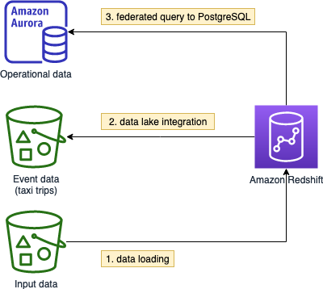

# Overview

Amazon Redshift is not only a data warehouse, but also tightly integrated with data lake (Amazon S3) and operational databases. This allows use cases like:

## Explore new insights by joining business data with event data
With Redshfit Spectrum, you can now experiment and explore new insights by joining business data (e.g., revenue) with event data (e.g., clickstream), identifying patterns like customer behaviors prior to making purchase.

## Unload historical data to data lake
With Redshift Spectrum, you can also unload historical data (e.g., after one year) to data lake to make the data warehouse leaner. Additionally, you may create a late binding view across both historical data and current data.

## Live data query
With Redshift Federated Query, you can now query live data residing in Amazon Aurora PostgreSQL and Amazon RDS for PostgreSQL from Amazon Redshift. Additionally, you can also simplify the ETL pipeline with familiar UPSERT patterns, without relying on other tools.

In this lab, you will:
* Provision an Amazon Redshift cluster and explore the operations
* Load sample data from a Amazon S3 bucket using the `COPY` command
* Explore how to monitor, scale and restore in Amazon Redshift
* Query event data directly in the Amazon S3 data lake using Amazon Redshift Spectrum
* Query operational data in PostgreSQL using federation

Duration:
* 1.5 hour

# Preparation

> Please use Chrome or Firefox browser to ensure smooth lab experience

* Sign in to the AWS Management Console using the provided credentials
* Make sure you are using the `us-west-2 (Oregon)` region for the whole workshop

## Create a S3 bucket

* Go to the [Amazon S3 console](https://s3.console.aws.amazon.com/s3/home)
* Click **Create bucket**
  * Bucket name: *spectrum.youname*
  * Region: Oregon
  * Click **Create**