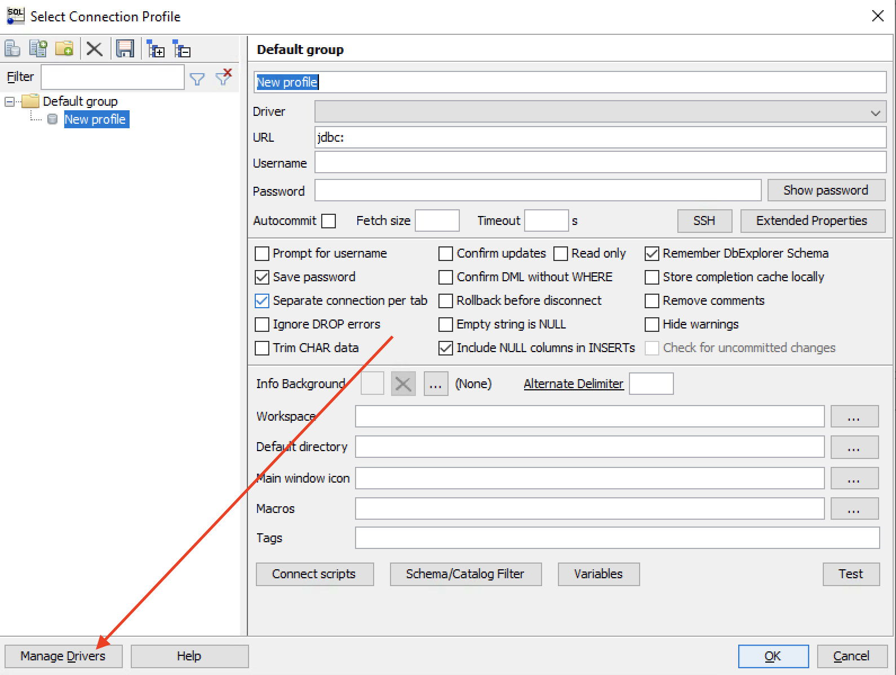
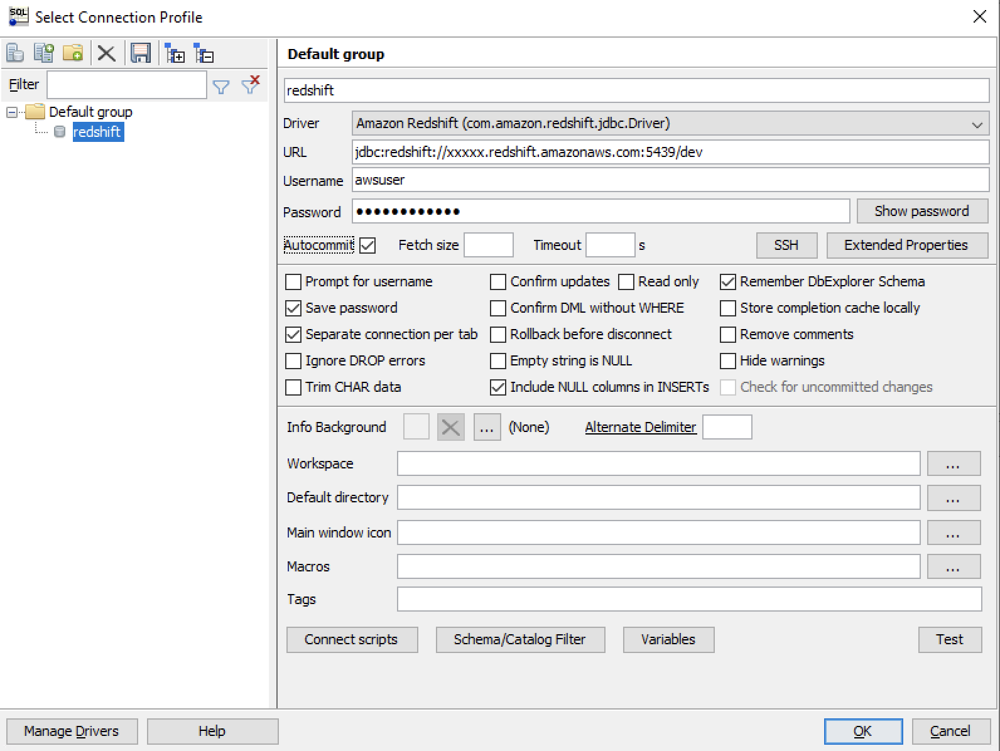

For the convenience of running this lab, you may consider accessing the Amazon Redshift cluster using a SQL client through the Internet.

- [SQL Workbench/J installation](#sql-workbenchj-installation)
- [Amazon Redshift public access](#amazon-redshift-public-access)
  - [Security group](#security-group)
- [Amazon Redshift JDBC driver](#amazon-redshift-jdbc-driver)
- [Connect](#connect)

# SQL Workbench/J installation
1. Download and extract the latest stable release from http://www.sql-workbench.eu/downloads.html
2. The tools requires JRE8 to run. Check if it has been installed in your machine.
> ```
> C:\Users\Administrator>java -version
> java version "1.8.0_251"
> Java(TM) SE Runtime Environment (build 1.8.0_251-b08)
> Java HotSpot(TM) Client VM (build 25.251-b08, mixed mode, sharing)
> ```

3. If not, run `download_jre.cmd` and it will install from [AdoptOpenJDK](https://adoptopenjdk.net)
4. Run `SQLWorkbench.exe` 

# Amazon Redshift public access
1. Go to the [EC2 console](https://console.aws.amazon.com/ec2/v2/)
2. On the navigator bar, under Network & Security, click **Elastic IPs**
3. Click **Allocate Elastic IP address**
4. Go to the [Redshift console](https://console.aws.amazon.com/redshiftv2/home)
5. Select the cluster and click **Action** -> **Modify publicly accessible setting**
   * Allow public access
   * Select the provisioned elastic IP address

## Security group
1. Click the Redshift cluster that we want to modify
2. In the **Properties** tab, locate **Network and security**
3. Click the **VPC security group**
4. Select the security group, click **Action** > **Edit inbound rule**
5. Add a new rule to allow access to Redshift from anywhere

6. Save

# Amazon Redshift JDBC driver
1. Download the latest driver (without driver dependent libraries) from https://docs.aws.amazon.com/redshift/latest/mgmt/configure-jdbc-connection.html#download-jdbc-driver 
2. In SQL Workbench/J, click **Manage Drivers**

3. Select **Amazon Redshift**
4. In the **Library**, point to the downloaded jar file and click **OK**

# Connect
1. Driver: *Amazon Redshift*
2. URL: *jdbc:redshift://xxxxx.redshift.amazonaws.com:5439/dev* (copy the JDBC URL from the Redshift console)
3. Input the username and password
4. Check *Autocommit*
5. Click **OK**
