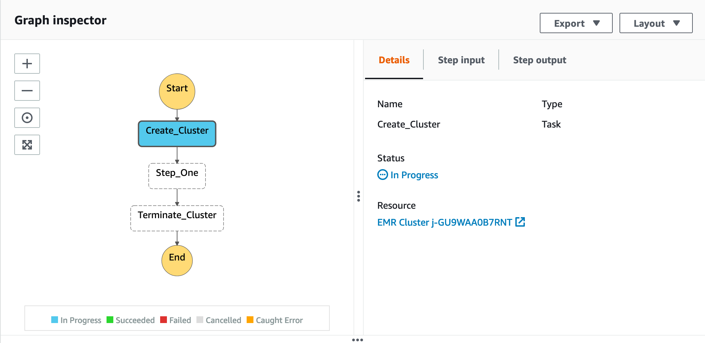
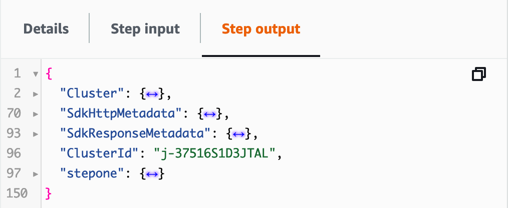

- [Using AWS Step Functions to orchestrate EMR job](#using-aws-step-functions-to-orchestrate-emr-job)
  - [Benefits](#benefits)
- [Developing state machine using VS Code](#developing-state-machine-using-vs-code)
  - [Benefits](#benefits-1)
  - [Install AWS Toolkit](#install-aws-toolkit)
  - [Configure the credentials](#configure-the-credentials)
    - [AWS CLI](#aws-cli)
    - [IAM](#iam)
- [Writing Amazon States Language (ASL)](#writing-amazon-states-language-asl)
  - [Provision cluster](#provision-cluster)
    - [Copy the config from an existing cluster](#copy-the-config-from-an-existing-cluster)
    - [Modify the values in the ASL file](#modify-the-values-in-the-asl-file)
    - [Publish to Step Functions](#publish-to-step-functions)
  - [Terminate cluster](#terminate-cluster)
  - [Add a step](#add-a-step)
- [References](#references)

# Using AWS Step Functions to orchestrate EMR job

## Benefits

We can use a **transient cluster**: terminating the cluster right after job completion, to reduce the cost.



# Developing state machine using VS Code

## Benefits
* Familiar IDE
* Side-by-side visualization of the workflow
* Automatic linting <-- important for debugging

> Check https://aws.amazon.com/blogs/compute/aws-step-functions-support-in-visual-studio-code/

## Install AWS Toolkit

Search for "AWS Toolkit" from the extensions and install as usual

* For VS Code - [Marketplace](https://marketplace.visualstudio.com/items?itemName=AmazonWebServices.aws-toolkit-vscode)
* For VSCodium - [Open VSX Registry](https://open-vsx.org/extension/amazonwebservices/aws-toolkit-vscode)

## Configure the credentials

### AWS CLI
* Generate access key/secret key pair in the [IAM console](https://console.aws.amazon.com/iam/home)
* Install [AWS CLI](https://aws.amazon.com/cli/)
* Run `aws configure`
* In VS Code, pick **AWS: profile:default** in the lower right corner

> Refer to the [doc](https://docs.aws.amazon.com/cli/latest/userguide/cli-configure-quickstart.html) for detailed steps 

### IAM
* In the [IAM console](https://console.aws.amazon.com/iam/home), create a service role for Step Functions
  * Name: *StepFunctionsEMRRole*
  * Attached policies: *AWSLambdaRole*, *AmazonElasticMapReduceFullAccess* 

> Refer to the [doc](https://docs.aws.amazon.com/step-functions/latest/dg/procedure-create-iam-role.html) for detailed steps. We grant full access to EMR for simplicity, which needs to be further limited.

# Writing Amazon States Language (ASL)

* Create a new file with extension **.asl.json**
* VS Code recognizes the language type as **ASL**
* Paste the following content and click **Render graph**

```json
{
    "Comment": "EMR sample",
    "StartAt": "Pass",
    "States": {
        "Pass": {
            "Comment": "Pass",
            "Type": "Pass",
            "End": true
        }
    }
}
```


## Provision cluster

Start with just one step: create a cluster, to learn the basic of ASL.

* Replace the **Pass** section (i.e., line 5-9) with the following:

```json
"Create_Cluster": {
    "Type": "Task",
    "Resource": "arn:aws:states:::elasticmapreduce:createCluster.sync",
    "Parameters": {
        "Name": "MyWorkflowCluster",
        "VisibleToAllUsers": true,
        "ReleaseLabel": "emr-6.2.0",
        "Applications": [
            {
                "Name": "Hadoop"
            },
            {
                "Name": "Ganglia"
            },
            {
                "Name": "Spark"
            }
        ],
        "ServiceRole": "EMR_DefaultRole",
        "JobFlowRole": "EMR_EC2_DefaultRole",
        "LogUri": "s3n://aws-logs-123456789012-us-east-1/elasticmapreduce/",
        "Instances": {
            "KeepJobFlowAliveWhenNoSteps": true,
            "InstanceFleets": [
                {
                    "InstanceFleetType": "MASTER",
                    "Name": "MASTER",
                    "TargetOnDemandCapacity": 1,
                    "InstanceTypeConfigs": [
                        {
                            "InstanceType": "m6g.xlarge"
                        }
                    ]
                },
                {
                    "InstanceFleetType": "CORE",
                    "Name": "CORE",
                    "TargetOnDemandCapacity": 2,
                    "InstanceTypeConfigs": [
                        {
                            "InstanceType": "m6g.xlarge"
                        }
                    ]
                }
            ]
        },
        "Configurations": [
            {
                "Classification": "string",
                "Configurations": [
                    "Configuration"
                ],
                "Properties": {
                    "string": "string"
                }
            }
        ]
    },
    "End": true
}
```

* Note the lintings at:
  * line 3: The value of "StartAt" property must be the name of an existing state
  * line 5: The state cannot be reached. It must be referenced by at least one other state
* To correct, replace `Pass` with `Create_Cluster` in line 3

### Copy the config from an existing cluster

* In the [EMR console](https://console.aws.amazon.com/elasticmapreduce/home), locater the ID of the current cluster (terminated is fine)
* AWS CLI: `aws emr describe-cluster --cluster-id="j-1XII9HOVFTM5Z"`
* Copy the output

### Modify the values in the ASL file

* Back to the ASL file, modify the parameters accordingly. For example:
  * Name
  * ReleaseLabel
  * Applications (Don't specify versions here)
  * LogUri
  * Configurations

> Sample ASL at [scripts/state_machine_1.asl.json](scripts/state_machine_1.asl.json)

### Publish to Step Functions

* Click **Publish to Step Functions** on the top left corner
* Select **Quick Create**
* Select the Step Functions execution role
* Give it a name to publish

> Test the execution in [Step Functions console](https://console.aws.amazon.com/states/home?region=us-east-1#/statemachines). Note in the "Step output" the **ClusterId** will be passed along to the next state.
>
> 

## Terminate cluster
We end by terminating the cluster, which can easily be done with this state:

```json
"Terminate_Cluster": {
    "Type": "Task",
    "Resource": "arn:aws:states:::elasticmapreduce:terminateCluster.sync",
    "Parameters": {
        "ClusterId.$": "$.ClusterId"
    },
    "End": true
}
```

1. Paste right after the `Create_Cluster` state, which looks like

2. Correct all errors in the ASL
   * `Terminate_Cluster` cannot be reached: Modify the previous `End` state to `Next` state
   * Format the document (`Option+Shift+F`) helps spot any missing commas or braces

> Sample ASL at [scripts/state_machine_2.asl.json](scripts/state_machine_2.asl.json)

## Add a step
Add a task state to run a PySpark script, in between cluster creation and termination. Note that we have added:
* `ResultPath` to keep passing the step input to step output, specifically we need the `ClusterId` for cluster termination
* `Retry`

```json
"Step_One": {
    "Type": "Task",
    "Resource": "arn:aws:states:::elasticmapreduce:addStep.sync",
    "Parameters": {
        "ClusterId.$": "$.ClusterId",
        "Step": {
            "Name": "The first step",
            "ActionOnFailure": "CONTINUE",
            "HadoopJarStep": {
                "Jar": "command-runner.jar",
                "Args": [
                    "spark-script",
                    "--deploy-mode",
                    "cluster",
                    "s3://bucket/path-to/dummy.py"
                ]
            }
        }
    },
    "Retry": [
        {
            "ErrorEquals": [
                "States.ALL"
            ],
            "IntervalSeconds": 1,
            "MaxAttempts": 3,
            "BackoffRate": 2.0
        }
    ],
    "ResultPath": "$.stepone",
    "End": true
}
```

> Sample ASL at [scripts/state_machine_3.asl.json](scripts/state_machine_3.asl.json)



# References
* https://docs.aws.amazon.com/step-functions/latest/dg/connect-emr.html
* https://docs.aws.amazon.com/emr/latest/APIReference/API_RunJobFlow.html
