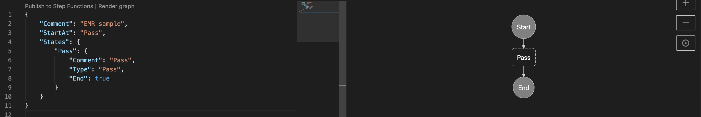
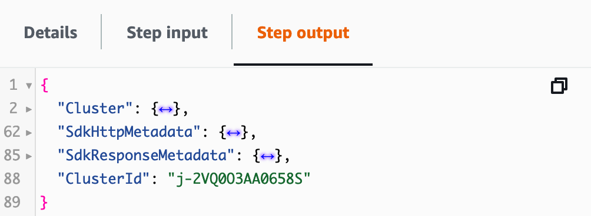
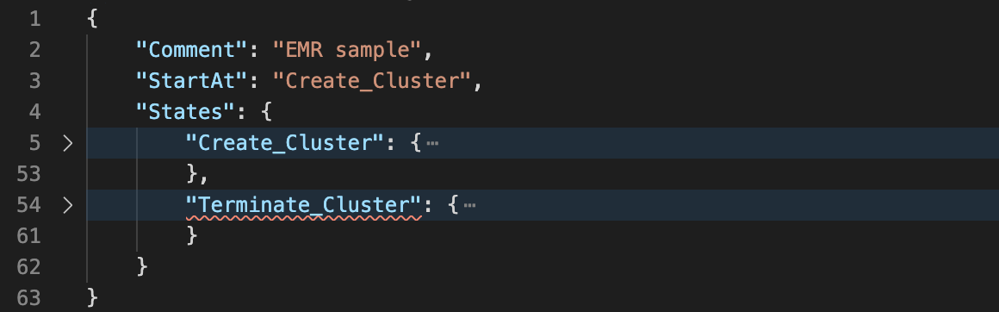

- [Using AWS Step Functions to orchestrate EMR job](#using-aws-step-functions-to-orchestrate-emr-job)
  - [Benefits](#benefits)
- [Developing state machine using VS Code](#developing-state-machine-using-vs-code)
  - [Benefits](#benefits-1)
  - [Install AWS Toolkit](#install-aws-toolkit)
  - [Configure the credentials](#configure-the-credentials)
    - [AWS CLI](#aws-cli)
    - [IAM](#iam)
- [Writing Amazon States Language (ASL)](#writing-amazon-states-language-asl)
  - [Provision cluster](#provision-cluster)
    - [Copy the config from an existing cluster](#copy-the-config-from-an-existing-cluster)
    - [Modify the values in the ASL file](#modify-the-values-in-the-asl-file)
    - [Publish to Step Functions](#publish-to-step-functions)
  - [Terminate cluster](#terminate-cluster)
  - [Add a step](#add-a-step)
  - [Add parallel steps](#add-parallel-steps)
- [References](#references)

# Using AWS Step Functions to orchestrate EMR job

## Benefits

We can use a **transient cluster**: terminating the cluster right after job completion, to reduce the cost.

[sample workflow]

# Developing state machine using VS Code

## Benefits
* Familiar IDE
* Side-by-side visualization of the workflow
* Automatic linting 

> Check https://aws.amazon.com/blogs/compute/aws-step-functions-support-in-visual-studio-code/

## Install AWS Toolkit

Search for "AWS Toolkit" from the extensions and install as usual

## Configure the credentials

### AWS CLI
* Generate access key/secret key pair in the [IAM console](https://console.aws.amazon.com/iam/home)
* Install [AWS CLI](https://aws.amazon.com/cli/)
* Run `aws configure`
* In VS Code, pick **AWS: profile:default** in the lower right corner

### IAM
* In the [IAM console](https://console.aws.amazon.com/iam/home), create a service role for Step Functions
  * Name: *StepFunctionsEMRRole*
  * Attached policies: *AWSLambdaRole*, *AmazonElasticMapReduceFullAccess* 

# Writing Amazon States Language (ASL)

* Create a new xxx.asl.json file
* Change the language type to **ASL**
* Paste the following content and click **Render graph**

```json
{
    "Comment": "EMR sample",
    "StartAt": "Pass",
    "States": {
        "Pass": {
            "Comment": "Pass",
            "Type": "Pass",
            "End": true
        }
    }
}
```



## Provision cluster

Start with just one step: create a cluster

* Replace the *Pass* section (i.e., line 5-9) with the following

```json
"Create_Cluster": {
    "Type": "Task",
    "Resource": "arn:aws:states:::elasticmapreduce:createCluster.sync",
    "Parameters": {
        "Name": "MyWorkflowCluster",
        "VisibleToAllUsers": true,
        "ReleaseLabel": "emr-5.32.0",
        "Applications": [
            {
                "Name": "Hive"
            }
        ],
        "ServiceRole": "EMR_DefaultRole",
        "JobFlowRole": "EMR_EC2_DefaultRole",
        "LogUri": "s3n://aws-logs-123456789012-us-east-1/elasticmapreduce/",
        "Instances": {
            "KeepJobFlowAliveWhenNoSteps": true,
            "InstanceFleets": [
                {
                    "InstanceFleetType": "MASTER",
                    "Name": "MASTER",   
                    "TargetOnDemandCapacity": 1,
                    "InstanceTypeConfigs": [
                        {
                            "InstanceType": "m6g.xlarge"
                        }
                    ]
                },
                {
                    "InstanceFleetType": "CORE",
                    "Name": "CORE",
                    "TargetOnDemandCapacity": 2,
                    "InstanceTypeConfigs": [
                        {
                            "InstanceType": "m6g.xlarge"
                        }
                    ]
                }
            ]
        }
    },
    "End": true
}
```

* Note the linting at line 3 `StartAt` and line 5 `Create_Cluster`. We have to correct this pair:
  > In line 3, replace `Pass` with `Create_Cluster`

### Copy the config from an existing cluster

* In the [EMR console](https://console.aws.amazon.com/elasticmapreduce/home), locater the ID of the current cluster (terminated is fine)
* AWS CLI: `aws emr describe-cluster --cluster-id="j-1XII9HOVFTM5Z"`
* Copy the output

### Modify the values in the ASL file

* Back to the ASL file, modify the parameters accordingly. For example:
  * Name
  * ReleaseLabel
  * Applications (Don't specify versions here)
  * LogUri

> Sample ASL at [scripts/state_machine_1.asl.json](scripts/state_machine_1.asl.json)

### Publish to Step Functions

* Click **Publish to Step Functions** on the top left corner
* Select **Quick Create**
* Select the Step Functions execution role
* Give it a name to publish

> Test the execution in [Step Functions console](https://console.aws.amazon.com/states/home?region=us-east-1#/statemachines). Note in the "Step output" the **ClusterId** will be passed along to the next state.
>
> 

## Terminate cluster
We end by terminating the cluster, which can easily be done with this state:

```json
"Terminate_Cluster": {
    "Type": "Task",
    "Resource": "arn:aws:states:::elasticmapreduce:terminateCluster.sync",
    "Parameters": {
        "ClusterId.$": "$.ClusterId"
    },
    "End": true
}
```

1. Paste right after the `Create_Cluster` state, which looks like

2. Correct all errors in the ASL
   * `Terminate_Cluster` cannot be reached: Modify the previous `End` state to `Next` state
   * Format the document (`Option+Shift+F`) helps spot any missing commas or braces

> Sample ASL at [scripts/state_machine_2.asl.json](scripts/state_machine_2.asl.json)

## Add a step

## Add parallel steps

# References
* https://docs.aws.amazon.com/step-functions/latest/dg/connect-emr.html
* https://aws.amazon.com/blogs/aws/new-using-step-functions-to-orchestrate-amazon-emr-workloads/