# RDS Workshop (Level 300)

# 1. Setup

## Provisioning MySQL

* Engine options
    * MySQL Community > Version 5.7.22
* Template
    * Dev/Test
* DB instance size
    * Burstable classes > db.t3.medium
* Aditional configuration
    * Enable log exports (audit, error, general, slow query)

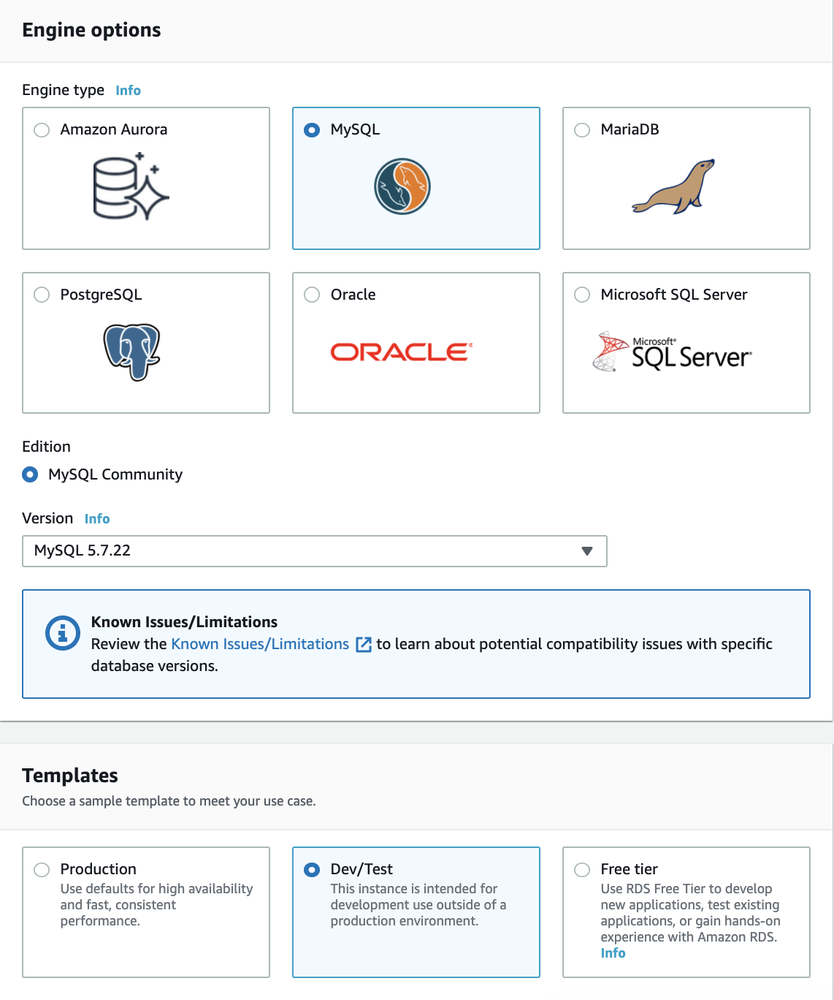
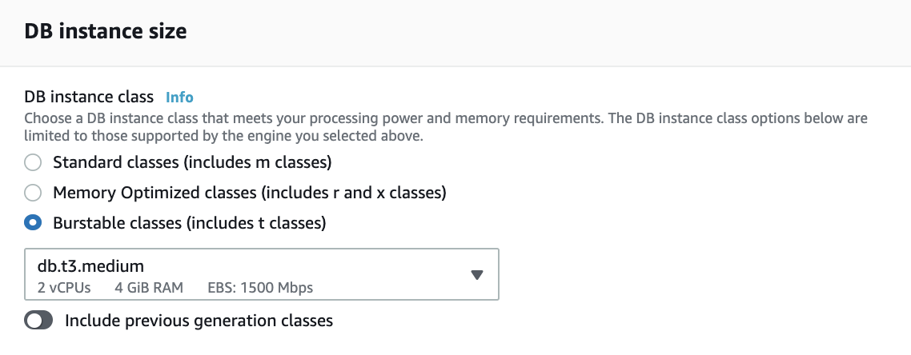

### Advanced discussions

* Storage IOPS & autoscaling - [doc](https://docs.aws.amazon.com/AmazonRDS/latest/UserGuide/CHAP_Storage.html#Concepts.Storage.GeneralSSD)
* Multi-AZ - [blog](https://aws.amazon.com/blogs/database/amazon-rds-under-the-hood-multi-az/)
* Supported Oracle version - [doc](https://docs.aws.amazon.com/AmazonRDS/latest/UserGuide/CHAP_Oracle.html)

## Provisioning Cloud9

Cloud9 is a cloud IDE for writing, running, and debugging code. We will need a **t3.small** instance (not the default!) for a small scale load test.


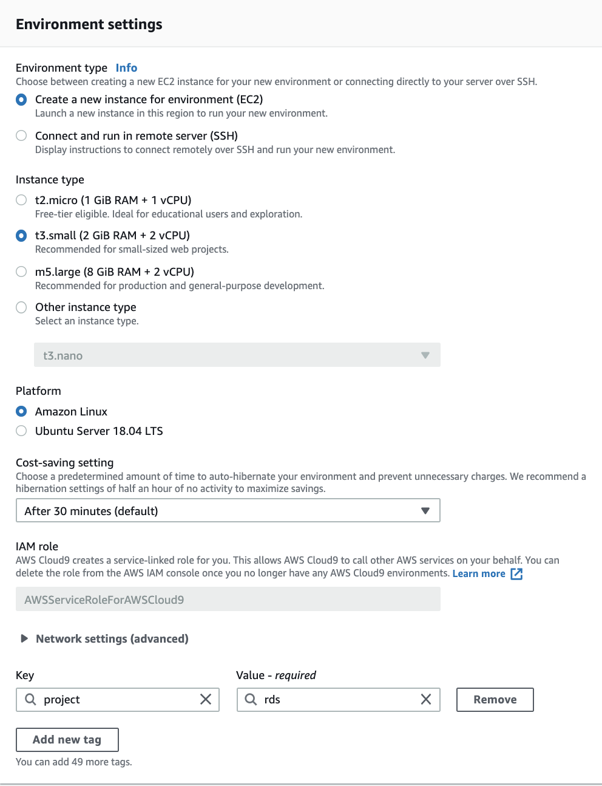

In just a minute, we now have a cloud based development environment with AWS CLI and mysql.

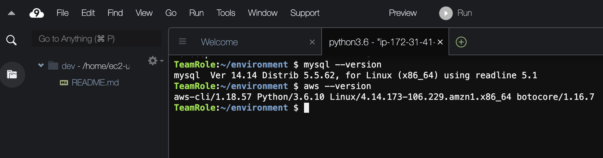

## Connect from Cloud9

Lodate the RDS MySQL endpoint from the console
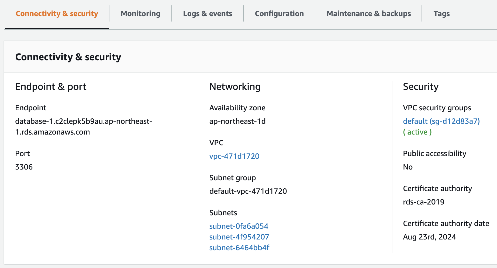

Locate the inbound security group
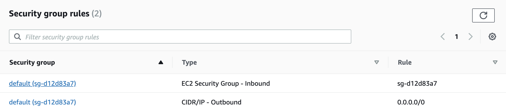

Edit the inbound rules
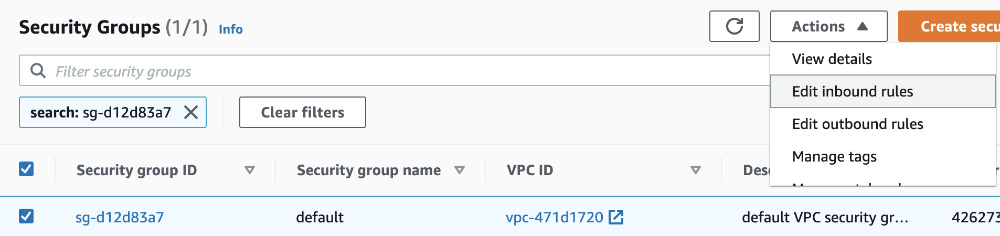

Add a rule to allow MySQL (TCP 3306) access from the cloud9 security group
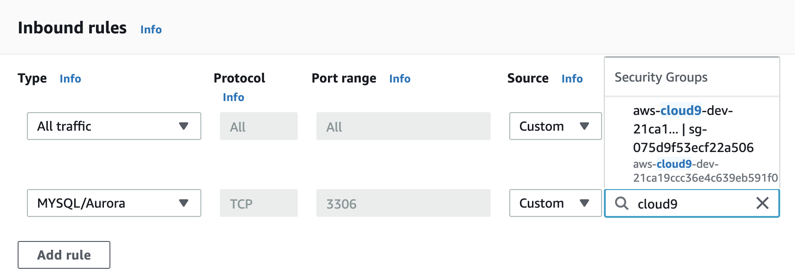

Test the connectivity from the Cloud9 client
```
$ mysql -h database-2.clp45lfuan0s.ap-northeast-1.rds.amazonaws.com -u admin -p

mysql> select version();
+------------+
| version()  |
+------------+
| 5.7.22-log |
+------------+
1 row in set (0.01 sec)

```

## Loading sample data

> Reference: https://github.com/datacharmer/test_db

### Clone the test_db github repository

```
$ git clone https://github.com/datacharmer/test_db.git

Cloning into 'test_db'...
remote: Enumerating objects: 105, done.
remote: Total 105 (delta 0), reused 0 (delta 0), pack-reused 105
Receiving objects: 100% (105/105), 74.27 MiB | 18.47 MiB/s, done.
Resolving deltas: 100% (54/54), done.
```

### Populate the sample database

```
$ cd test_db
$ mysql -h database-2.clp45lfuan0s.ap-northeast-1.rds.amazonaws].com -u admin -p < employees.sql

Enter password: 
INFO
CREATING DATABASE STRUCTURE
INFO
storage engine: InnoDB
INFO
LOADING departments
INFO
LOADING employees
INFO
LOADING dept_emp
INFO
LOADING dept_manager
INFO
LOADING titles
INFO
LOADING salaries
data_load_time_diff
00:00:32
```

### Verify the installation

```
$ mysql -h database-2.clp45lfuan0s.ap-northeast-1.rds.amazonaws.com -u admin -p -t < test_employees_md5.sql 

Enter password: 
+----------------------+
| INFO                 |
+----------------------+
| TESTING INSTALLATION |
+----------------------+
+--------------+------------------+----------------------------------+
| table_name   | expected_records | expected_crc                     |
+--------------+------------------+----------------------------------+
| employees    |           300024 | 4ec56ab5ba37218d187cf6ab09ce1aa1 |
| departments  |                9 | d1af5e170d2d1591d776d5638d71fc5f |
| dept_manager |               24 | 8720e2f0853ac9096b689c14664f847e |
| dept_emp     |           331603 | ccf6fe516f990bdaa49713fc478701b7 |
| titles       |           443308 | bfa016c472df68e70a03facafa1bc0a8 |
| salaries     |          2844047 | fd220654e95aea1b169624ffe3fca934 |
+--------------+------------------+----------------------------------+
+--------------+------------------+----------------------------------+
| table_name   | found_records    | found_crc                        |
+--------------+------------------+----------------------------------+
| employees    |           300024 | 4ec56ab5ba37218d187cf6ab09ce1aa1 |
| departments  |                9 | d1af5e170d2d1591d776d5638d71fc5f |
| dept_manager |               24 | 8720e2f0853ac9096b689c14664f847e |
| dept_emp     |           331603 | ccf6fe516f990bdaa49713fc478701b7 |
| titles       |           443308 | bfa016c472df68e70a03facafa1bc0a8 |
| salaries     |          2844047 | fd220654e95aea1b169624ffe3fca934 |
+--------------+------------------+----------------------------------+
+--------------+---------------+-----------+
| table_name   | records_match | crc_match |
+--------------+---------------+-----------+
| employees    | OK            | ok        |
| departments  | OK            | ok        |
| dept_manager | OK            | ok        |
| dept_emp     | OK            | ok        |
| titles       | OK            | ok        |
| salaries     | OK            | ok        |
+--------------+---------------+-----------+
+------------------+
| computation_time |
+------------------+
| 00:00:11         |
+------------------+
+---------+--------+
| summary | result |
+---------+--------+
| CRC     | OK     |
| count   | OK     |
+---------+--------+
```

# 2. Monitoring

## CloudWatch Metrics
Browse to the **Monitoring**`** tab and check
* CPU/RAM
* Disk space
* Network traffic
* Database connections
* IOPS metrics

## Enhanced monitoring
> Look at metrics in real-time for the operating system

Select **Enhanced monitoring**


Check the list of available metrics
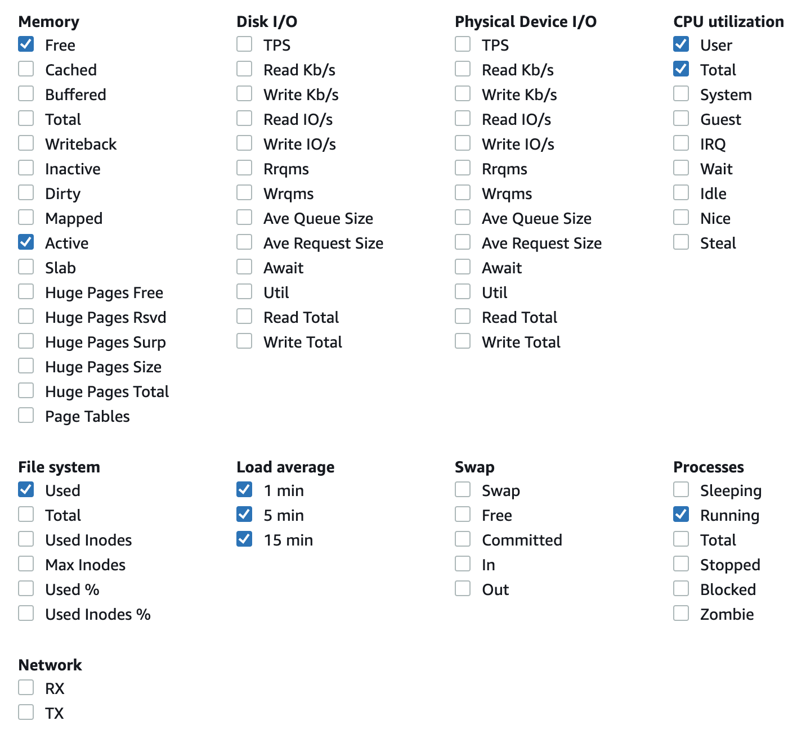

## Performance insight
> Illustrate your database's performance and help you analyze any issues that affedt it.

Generate some loading to the database using `mysqlslap`
```
mysqlslap -h database-2.clp45lfuan0s.ap-northeast-1.rds.amazonaws.com -u admin -p \
--create-schema=employees \
--query="SELECT * FROM employees;" \
--concurrency=50 \
--iterations=10

Enter password: 
Benchmark
        Average number of seconds to run all queries: 7.874 seconds
        Minimum number of seconds to run all queries: 7.688 seconds
        Maximum number of seconds to run all queries: 8.867 seconds
        Number of clients running queries: 50
        Average number of queries per client: 1
```
Check the **Performance insight**
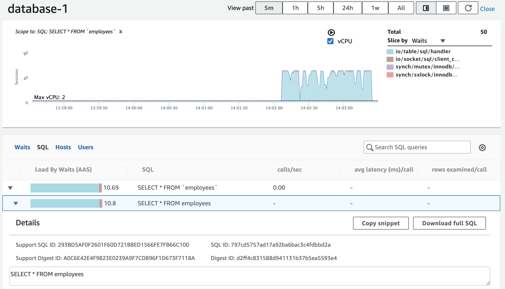

# 3. Upgrade

Modify the database instance, and select a newer (minor) version, e.g., 5.7.28
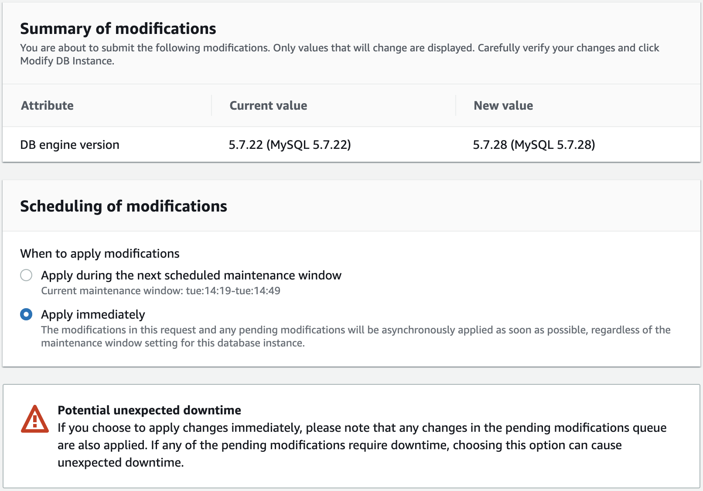

### Advanced discussion

While upgrading, it's a good time to review different fault tolerance options:

* Single-AZ: PITR (5-min RPO) - [doc](https://docs.aws.amazon.com/AmazonRDS/latest/UserGuide/USER_PIT.html)
* Multi-AZ: automatic failover (typically within 1-2 minutes)
* Read-replica: scaling read-only workload - [doc](https://docs.aws.amazon.com/AmazonRDS/latest/UserGuide/USER_ReadRepl.html)

# 4. Availability

## PITR

RDS uploads transaction logs for DB instances to Amazon S3 every 5 minutes. We can create a new database instance with data up to the latest restorable time.

From the console, select **Restore to point in time**
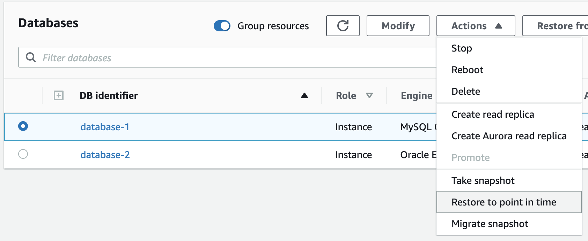

## Read Replica

Updates made to the source DB instance are asynchronously copied to the read replica. We can make use of this to scale out elastically for read-heavy database workloads.

From the console, select ** Create read replica**
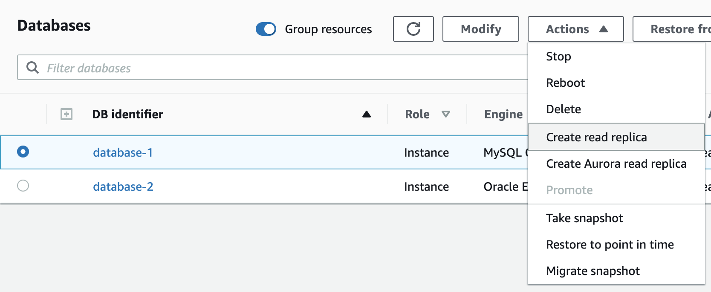

Notes:

* Can create read replica in another region (not available in HKG yet)
* Can create read replica on read replica, but not circular action
* Can promote read replica to a standalone DB instance

## Aurora Read Replica

We can create a read replica with a Aurora cluster, by clicking **Create Aurora read replica**
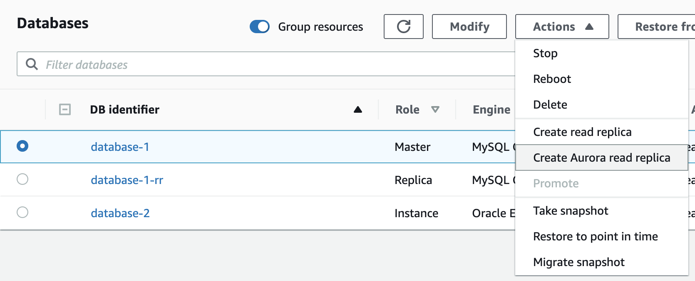

# Working with snapshots

## Copy across regions

> Currently not available in HKG

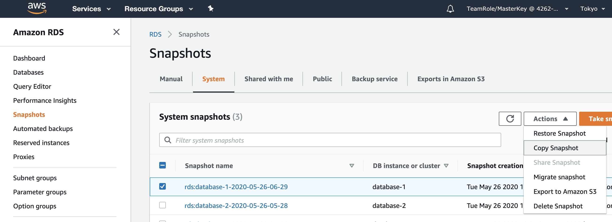

## Export snapshots to S3

We can export the whole database, a schema or schema.table to Parquet files in S3 for analytics purpose.

> Currently not available in HKG

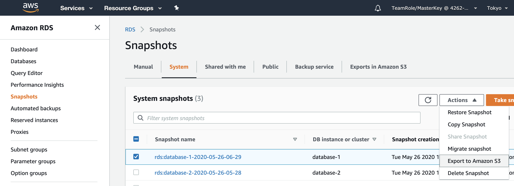

# Advanced topics: Architecture with Aurora

* Cloud native storage - [blog](https://aws.amazon.com/blogs/database/introducing-the-aurora-storage-engine/)
* High availability with (Aurora) read replica - [doc](https://docs.aws.amazon.com/AmazonRDS/latest/AuroraUserGuide/Concepts.AuroraHighAvailability.html)
* Global database - [10min tutorial](https://aws.amazon.com/getting-started/hands-on/aurora-global-database/)
* Aurora read replica auto-scaling - [10min tutorial](https://aws.amazon.com/getting-started/hands-on/aurora-autoscaling-with-readreplicas/)
