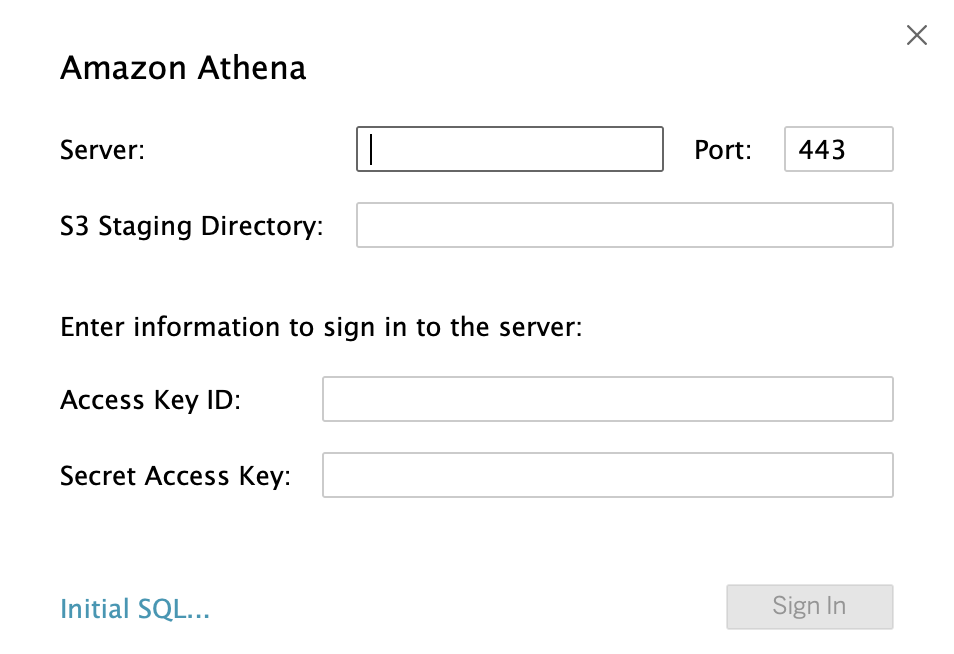
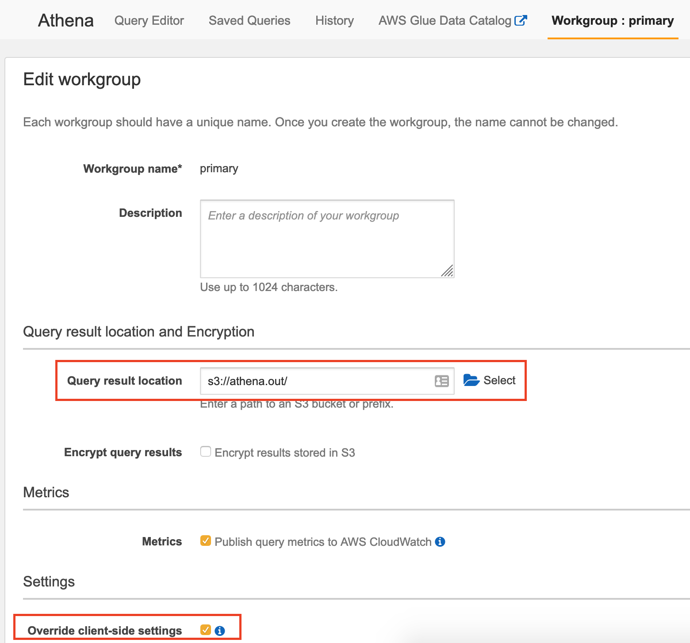
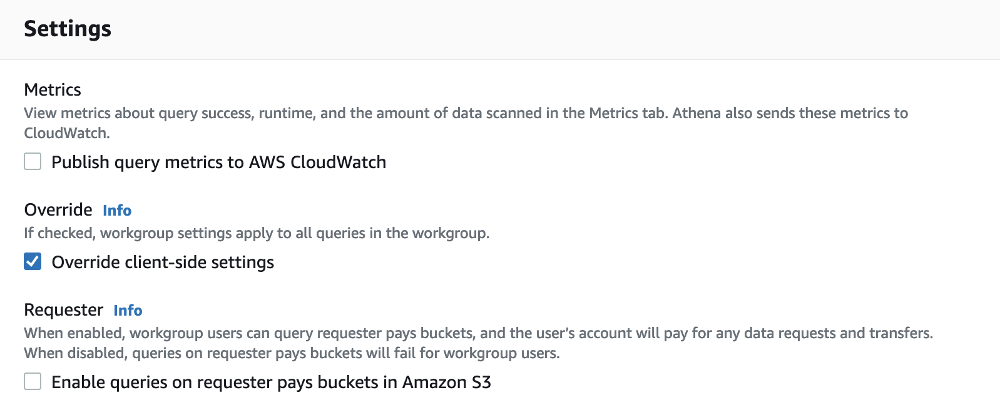

> Tested on Tableau Desktop 2021.3.3

# 1. Connecting Tableau to Amazon Athena
This is a short guide helping you to fill in the Amazon Athena connection info



## 1.1. JDBC driver
1. Install the latest JRE8

2. Download the JDBC driver with AWS SDK from https://docs.aws.amazon.com/athena/latest/ug/connect-with-jdbc.html
and save to:
* Mac: `/Library/JDBC/`
* Windows: `C:\Program Files\Tableau\Drivers`

## 1.2. Server
Locate the service endpoint (not ARN) for your region from https://docs.aws.amazon.com/general/latest/gr/athena.html

Example: `athena.eu-west-1.amazonaws.com`

## 1.3. S3 Staging Directory
In your **Athena Console**, modify the **primary workgroup**:
* Query result location: `s3://<yourbucket>/`
* Override client-side settingd: `Enabled`





## 1.4. Access Key ID & Secret Access Key
There are several tested ways to authenticate:
* IAM user (very straight forward, not discussing here)
* Named profile with session token

### 1.4.1. Named profile with session token

1. Prepare the named profile, using `default` as an example

.aws/credentials
```
[default]
aws_access_key_id = xxxx
aws_secret_access_key = xxxx
aws_session_token = xxxx
```

2. Prepare the properties file

athena.properties
```
Workgroup=primary
AwsCredentialsProviderClass=com.simba.athena.amazonaws.auth.profile.ProfileCredentialsProvider
AwsCredentialsProviderArguments=default
```

3. Put it to the data sources folder
* Mac: `Documents/My Tableau Repository/Data sources`
