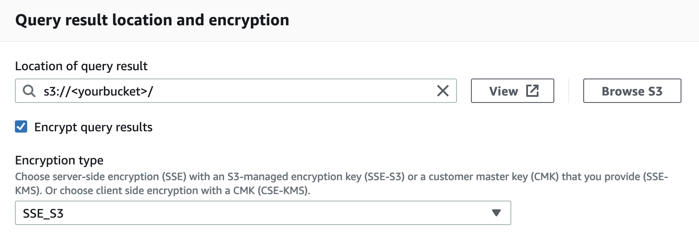

# Connecting Tableau to Amazon Athena
This is a short guide helping you to fill in the connection info to Amazon Athena, on a Tableau Desktop 10.3 -2019.4

## JDBC driver
1. Install `JRE8u231` from https://java.com/en/download/manual.jsp

2. Download the JDBC driver from https://docs.aws.amazon.com/athena/latest/ug/connect-with-jdbc.html
and save to `/Library/JDBC/AthenaJDBC42-2.0.9.jar`

## Server
Locate the service endpoint (not ARN) for your region from https://docs.aws.amazon.com/general/latest/gr/rande.html#athena

Example: `athena.ap-northeast-1.amazonaws.com`

## S3 Staging Directory
In your **Athena Console**, modify the **primary workgroup**:
* Query result location: `s3://<yourbucket>/`
* Override client-side settingd: `Enabled`

## Access Key ID & Secret Access Key
In your **IAM Console**, add a new user:
* User name: `tableau`
* Access type: `Programmatic access`
* Create group: `analytics`
* Policy: `AmazonAthenaFullAccess`, `AmazonS3FullAccess`

Save the access key pair safely in your computer. You will need to refer to this every day.
