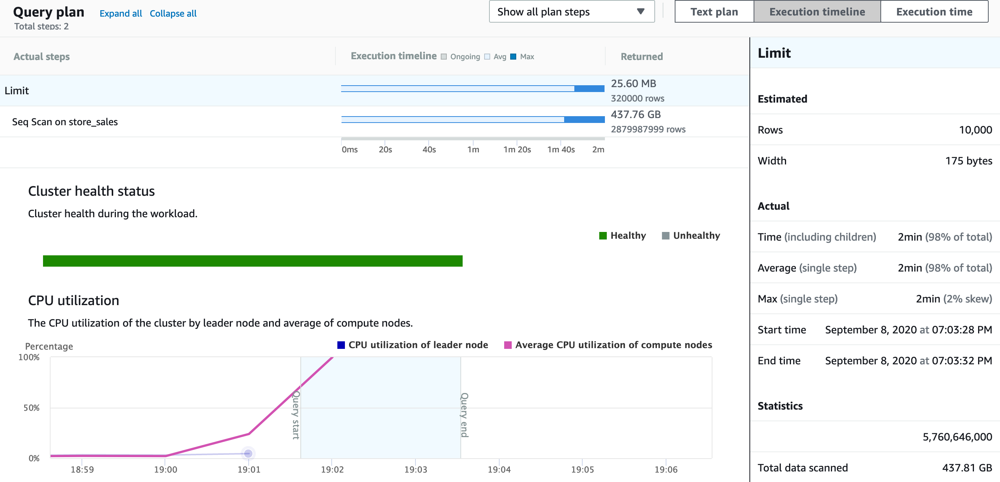

- [1. Using rJDBC](#1-using-rjdbc)
  - [1.1. Prerequisites](#11-prerequisites)
  - [1.2. Configure the Java environment in R](#12-configure-the-java-environment-in-r)
  - [1.3. Install RJDBC](#13-install-rjdbc)
  - [1.4. Connect](#14-connect)
  - [1.5. Data sampling into a data frame](#15-data-sampling-into-a-data-frame)
- [2. Using dplyr](#2-using-dplyr)
  - [2.1. Prerequisites](#21-prerequisites)
  - [2.2. Connect](#22-connect)
  - [2.3. Reference to the table](#23-reference-to-the-table)
  - [2.4. Query against the table](#24-query-against-the-table)
- [3. References](#3-references)

# 1. Using rJDBC

This is the recommended way as we can take advantage of the optimizations in the Redshift JDBC driver. A major draw back is that we need to write the queries in SQL, which is database engine specific.

> Another way which uses ODBC at https://db.rstudio.com/databases/redshift/

## 1.1. Prerequisites
* [AdoptOpenJDK, not JRE](https://github.com/AdoptOpenJDK/homebrew-openjdk)
* [Redshift JDBC driver, without SDK](https://docs.aws.amazon.com/redshift/latest/mgmt/configure-jdbc-connection.html#download-jdbc-driver)

## 1.2. Configure the Java environment in R

```R
install.packages('rJava')
```

> In my MacBook it throws errors about missing `xcrun` which can be fixed by running `xcode-select --install`

For first time installation, the installer may prompt to run `sudo R CMD javareconf JAVA_HOME=/Library/Java/JavaVirtualMachines/adoptopenjdk-8.jdk/Contents/Home` to add Java support to R.

Make sure the JAVA_HOME is not pointing to the JRE directory
```
JAVA_HOME        : /Library/Java/JavaVirtualMachines/adoptopenjdk-8.jdk/Contents/Home
Java library path: $(JAVA_HOME)/jre/lib/server
JNI cpp flags    : -I$(JAVA_HOME)/include -I$(JAVA_HOME)/include/darwin
JNI linker flags : -L$(JAVA_HOME)/jre/lib/server -ljvm
Updating Java configuration in /usr/local/Cellar/r/4.0.2_1/lib/R
Done.
```

## 1.3. Install RJDBC

```R
install.packages('RJDBC')
```

## 1.4. Connect

```R
library(RJDBC)

driver <- JDBC("com.amazon.redshift.jdbc42.Driver",
               "RedshiftJDBC42-no-awssdk-1.2.47.1071.jar",
               identifier.quote="`")

#JDBC URL. Can be copied from Redshift console
url <- "jdbc:redshift://xxx.redshift.amazonaws.com:5439/dev?user=xxx&password=xxx"

conn <- dbConnect(driver, url)
```

## 1.5. Data sampling into a data frame

Get the tables as a dataframe for further process
```R
tables <- dbGetTables(conn)

tables[tables$TABLE_SCHEM == 'public', ]
```

List table structure
```R 
dbListFields(conn, 'store_sales')
```

Get some random samples into a dataframe for further process
```R
# Since Redshift is columnar-based, the best practice is to SELECT only required columns. We are using * for illustration purpose only.

df <- dbGetQuery(conn,
                 "SELECT * FROM store_sales ORDER BY RANDOM() LIMIT 10000")
```

In the Redshift console, look at how the query runs:


Show the df dimension
```
> dim(df)
[1] 10000    23
```

Now we can start explore the data in the usual way such as `summary()`.

> Don't forget to close the connection with `dbDisconnect(conn)`

# 2. Using dplyr

This method provides a high level abstraction, and the code is more "R" and hence portable. However, I can't figure out a way to perform random sampling on the server side, limiting the data exploration to small dataset only.

## 2.1. Prerequisites

Optionally, install `tidyverse`
```R
install.packages(c('dplyr', 'dbplyr', 'RPostgreSQL'))
```

## 2.2. Connect

```R
library(dplyr)
```

```R
con <- DBI::dbConnect(RPostgreSQL::PostgreSQL(), 
                      host = "xxx.redshift.amazonaws.com",
                      port = "5439",
                      dbname = 'dev',
                      user = "corvus",
                      password = rstudioapi::askForPassword("Database password")
)
```

## 2.3. Reference to the table

```R
store_sales <- tbl(con, "store_sales")
```

## 2.4. Query against the table

```R
head(store_sales)
```

Now we can start process the data in the usual `dplyr` way, such as `select`, `filter`, `group_by`, etc. which we won't go through here.

# 3. References
https://aws.amazon.com/blogs/big-data/connecting-r-with-amazon-redshift/
https://db.rstudio.com/dplyr/
